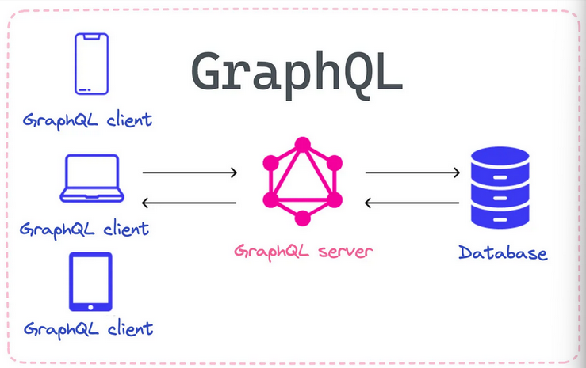

# GraphQL Interview Questions



1. ## **What is a query language**

   A query language is:

   - A way to **ask for data** from a database or API
   - Uses specific **commands (queries)** to get only what you need

   **Example**:

   - `SQL` asks databases for data
   - `GraphQL` asks APIs for data

   **Key Point**:  
   GraphQL is a query language **for APIs** (not databases).

2. ## **What is GraphQL**

   - **Type**: Open-source API query language
   - **Purpose**: Lets clients request _exact data needed_ (no over-fetching)
   - **Key Advantage**: Single request fetches nested/related data

   ### **vs REST**:

   | GraphQL                    | REST                       |
   | -------------------------- | -------------------------- |
   | One flexible endpoint      | Multiple fixed endpoints   |
   | Client-controlled response | Server-controlled response |
   | No versioning needed       | Often requires versioning  |

3. ## **How does GraphQL work**

   ### **Basic Flow**

   1. **Client Sends Query**

   - Single POST request to `/graphql` endpoint
   - Request contains exact data requirements
     ```graphql
     query {
       user(id: "101") {
         name
         email
       }
     }
     ```

   2. **Server Processes**

   - Validates query against schema
   - Fetches data from:
     - Databases
     - Microservices
     - REST APIs
     - Other sources

   3. **Response**

   - Returns JSON with exact requested structure
   - No extra data (unlike REST)
     ```json
     {
       "data": {
         "user": {
           "name": "Alice",
           "email": "alice@example.com"
         }
       }
     }
     ```

   ### **Key Components**

   - **Single Endpoint:** No versioning/endpoint sprawl
   - **Type System:** Strongly-typed schema defines possible operations
   - **Resolver Functions:** Custom logic for each field

   ### **Visual:**

   _Client → HTTP POST → GraphQL Server → Resolvers → Data Sources → JSON
   Response_

4. ## **What is Apollo Client/Server**

   **Apollo Client**

   - Frontend GraphQL library
   - Features:
     - Smart caching
     - Local state management
     - Optimized data fetching

   **Apollo Server**

   - Backend GraphQL server
   - Supports:
     - All major Node.js frameworks
     - Easy schema setup
     - Data source integrations

   **_"Batteries-included GraphQL toolkit"_**

5. ## **What are the three types of operations in GraphQL**

   In GraphQL, there are three main types of operations:

   ### **1. Query** (Read data)

   _A query is used to request data from a GraphQL server. It resembles the
   shape of the data you want to retrieve and allows you to specify the fields
   you're interested in. Queries are read-only operations, meaning they don't
   modify data on the server_

   ```graphql
   query GetUser {
     user(id: "123") {
       name
       email
     }
   }
   ```

   ### **2. Mutation** (Modify data)

   _A mutation is used to modify data on the server. It can be used to create,
   update, or delete data. Unlike queries, mutations can have side effects and
   are not limited to reading data._

   ```graphql
   mutation CreatePost {
     addPost(title: "Hello", content: "World") {
       id
       title
     }
   }
   ```

   ### **3. Subscription** (Real-time updates)

   _A subscription allows clients to receive real-time updates when certain
   events occur on the server. It is often used for implementing features like
   live notifications, chat applications, or any scenario where real-time data
   updates are needed._

   ```graphql
   subscription OnNewMessage {
     newMessage(channel: "general") {
       text
       author
     }
   }
   ```

   ### **Key Differences**

   | Operation        | Purpose       | Side Effects | Typical Use               |
   | ---------------- | ------------- | ------------ | ------------------------- |
   | **Query**        | 🔍 Read data  | None         | Fetching user profiles    |
   | **Mutation**     | ✏️ Write data | Yes          | Creating/updating records |
   | **Subscription** | 🔊 Listen     | Possible     | Live notifications, chat  |

6. ## **What are the key components of GraphQL**

   GraphQL has three fundamental components that work together:

   ### **1. Schema**

   The blueprint that defines:

   - All available data types (e.g., User, Product)
   - Relationships between types
   - Allowed operations (queries/mutations/subscriptions)

   ```graphql
   type User {
     id: ID!
     name: String!
     email: String!
   }

   type Query {
     getUser(id: ID!): User
   }
   ```

   ### **2. Resolvers**

   Functions that:

   - Contain the actual data-fetching logic
   - Execute when their associated field is requested
   - Can fetch from databases, APIs, or other services

   ```graphql
   const resolvers = {
       Query: {
           getUser: (parent, args) => {
           return db.users.find(user => user.id === args.id);
           }
       }
   }
   ```

   ### **3. Operations**

   The actions clients can perform:

   | Operation        | Description                        | Example Use Case          |
   | ---------------- | ---------------------------------- | ------------------------- |
   | **Query**        | Retrieve data (read-only)          | Get user profile          |
   | **Mutation**     | Modify data (create/update/delete) | Change user password      |
   | **Subscription** | Receive real-time updates          | New message notifications |

   **How They Work Together:**

   1. Client sends an operation (query/mutation)
   2. GraphQL validates against the Schema
   3. Appropriate Resolvers execute
   4. Data is collected and returned

7. ## **What is the difference between Query and Mutation in GraphQL**

   ### **Query** (Read)

   - Operation: Fetch data
   - Effect: No changes to server data
   - Analogous to: GET in REST

   ```graphql
       getUser(id: "123") {
           name
           email
       }
   ```

   ### **Mutation** (Write)

   - Operation: Modify data
   - Effect: Changes server state
   - Analogous to: POST/PUT/DELETE in REST
   - Example:
     ```graphql
     mutation {
       createUser(name: "Alex", email: "alex@example.com") {
         id
         name
       }
     }
     ```

   ### **Key Differences**

   | Aspect           | Query     | Mutation           |
   | ---------------- | --------- | ------------------ |
   | **Purpose**      | Read data | Modify data        |
   | **Side Effects** | None      | Yes (changes data) |
   | **Caching**      | Cacheable | Not cached         |

8. ## **When to Use GraphQL or REST**

   ### **Choose GraphQL When:**

   - **Data needs are complex/changing:** _(Dynamic queries for different client
     needs)_
   - **Real-time updates required:** _(Subscriptions for live data)_
   - **Microservices integration:** _(Aggregate multiple backends)_
   - **Client controls response shape:** _(Avoid over/under-fetching)_
   - **Same team owns client+server:** _(Easier schema coordination)_

   ### **Choose REST When:**

   - **Simple data requirements:** _(Fixed endpoints suffice)_
   - **Caching is critical:** _(HTTP caching works well)_
   - **Stable API contracts:** _(Infrequent changes)_
   - **Public APIs:** _(Wider compatibility)_
   - **Server-driven responses:** _(Fixed data structures)_

   ### **Decision Factors**

   | Factor           | GraphQL Advantage           | REST Advantage           |
   | ---------------- | --------------------------- | ------------------------ |
   | Data Flexibility | ✅ Custom queries           | ❌ Fixed responses       |
   | Performance      | ⚠️ Complex queries may slow | ✅ Predictable           |
   | Caching          | ❌ Harder                   | ✅ Built-in HTTP caching |
   | Learning Curve   | ⚠️ Steeper                  | ✅ Simpler               |
   | Team Structure   | ✅ Same team                | ❌ Cross-team            |

9. ## **How to Handle Errors in GraphQL**

   ### **Error Handling Approach**

   - **HTTP Status**: Always 200 OK (even for errors)
   - **Error Location**: Special `errors` array in response
   - **Response Structure**:

   ```json
   {
     "data": null,
     "errors": [
       {
         "message": "Error description",
         "locations": [{ "line": 6, "column": 7 }],
         "path": ["queryName"],
         "extensions": {
           "code": "UNAUTHENTICATED"
         }
       }
     ]
   }
   ```

   ### **Error Types**

   1. **Syntax Errors** - Malformed queries
   2. **Validation Errors** - Schema violations
   3. **Execution Errors** - Resolver failures
   4. **Custom Business Errors** - App-specific

   ### **Best Practices**

   - Include helpful error messages
   - Use `extensions` for error codes/details
   - Log server-side errors properly
   - Document common error cases

   ### **Key Points**

   - Clients must check both `data` and `errors` fields
   - Partial responses possible (some data + some errors)
   - Error shapes follow GraphQL spec

10. ## **What are directives in GraphQL, and how do you use them**

    _Directives are strings prefixed with an **“@”** symbol. They sit beside a
    field in a **query**, **mutation**, or **subscription**.(**@skip** skips the
    field or **@include** includes the field)_

11. ## **Explain the concept of fragments in GraphQL**

    _Fragments in GraphQL allow you to define reusable pieces of a query. They
    help in keeping the query structure modular and make it easier to maintain
    and understand_

    _Fragments are a way to group sets of fields together, allowing you to reuse
    those groups across multiple queries. Fragments help improve the
    maintainability and readability of your GraphQL queries by avoiding
    repetition of field selections. They provide a mechanism to define and name
    sets of fields on a GraphQL type, and then include those fields in various
    parts of your queries_

    ```graphql
    fragment UserInfo on User {
      id
      username
      email
    }
    ```

12. ## **What is federated schemas and microservices architecture in GraphQL**

    _Federated schemas and microservices architecture in GraphQL play a crucial
    role in the development of scalable and modular applications. **Federated
    schemas enable organizations to split their monolithic GraphQL API into
    smaller, domain specific services** Each service defines its part of the
    GraphQL schema and operates as an individual entity_

13. ## **What are GraphQL subscriptions**

    _It’s a way to push real time updates from the server to the client. GraphQL
    subscriptions provide live data to clients when specific events occur.
    Subscriptions differ from queries and mutations. Queries fetch data,
    mutations modify data, and subscriptions listen for data changes_

14. ## **How does GraphQL handle versioning**

    _GraphQL itself does not prescribe a specific versioning strategy, and
    versioning in GraphQL APIs is typically handled at the application level.
    There are several approaches to versioning GraphQL APIs, and the choice
    often depends on the specific requirements of the application and the
    development team's preferences_

    Here are some common strategies for handling versioning in GraphQL:

    **URL-based versioning:**

    - Include the version number in the URL. For example: /v1/graphql or
      /graphql/v2.
    - This approach is straightforward and easy to implement, but it can make
      the URLs less clean.

    **Custom request headers:**

    - Use custom headers to specify the API version. For instance, include a
      GraphQL-Version header in the request.
    - This approach keeps the URL clean but requires clients to include the
      custom header.

    **Field deprecation:**

    - Deprecate fields in the GraphQL schema that need to be versioned out.
    - This approach allows for a gradual transition and provides information to
      clients about deprecated fields.

15. ## **How does GraphQL handle security concerns**

    _GraphQL itself doesn't enforce security directly, but security measures can
    be implemented at various levels, such as validating and sanitizing inputs,
    controlling access through authentication and authorization mechanisms, and
    monitoring and rate-limiting queries_

16. ## **How does GraphQL handle circular dependencies**

    _Circular dependencies can occur in GraphQL schemas when types reference
    each other in a circular manner. For example, **Type A** may have a field
    that returns **Type B**, and **Type B** may have a field that returns **Type
    A**. This circular reference can potentially lead to issues during schema
    execution_

    Here are some strategies to handle circular dependencies in GraphQL:

    **Late Binding / Forward Declarations:**

    - One approach is to use late binding or forward declarations. In this
      strategy, one of the types involved in the circular reference is declared
      first, and the other type is referenced using a forward declaration. The
      forward declaration is resolved later in the process.
    - Some GraphQL schema definition languages or tools support forward
      declarations explicitly.

    **Lazy Loading or Resolving Fields Dynamically:**

    - Delay the resolution of circular references until runtime. You can use
      lazy loading or dynamic resolution techniques to handle circular
      dependencies when the actual data is requested.
    - Some GraphQL execution engines or libraries allow you to resolve fields
      dynamically, allowing you to resolve circular dependencies as needed.

17. ## **Explain the concept of introspection in GraphQL**

    _Introspection in GraphQL refers to the ability of a GraphQL server to query
    and provide information about its own schema. It allows clients to
    dynamically discover the types, fields, directives, and other aspects of the
    GraphQL API. Introspection is a powerful feature that makes GraphQL
    self-documenting and enables tools like GraphQL IDEs and query builders to
    provide auto-completion and validation_

    _To perform introspection, clients can send a special GraphQL query known as
    an introspection query to the GraphQL server. The query typically includes
    specific fields that the client wants information about, such as the types
    defined in the schema, the fields of a particular type, or the arguments a
    field accepts_

    ```graphql
    query IntrospectionQuery {
      __schema {
        types {
          name
          kind
          description
          fields {
            name
            type {
              name
              kind
            }
          }
        }
      }
    }
    ```

    _In this example, the client is querying the server for information about
    the types in the schema, including their names, kinds (e.g., OBJECT,
    SCALAR), descriptions, and the fields associated with each type_

    _The server responds with a JSON object containing details about the schema.
    The introspection results provide information about types, fields, enum
    values, input types, and more, allowing clients to understand the structure
    of the GraphQL API_

    _Introspection is not only valuable for tooling but also for validating
    queries and ensuring that they adhere to the schema. It is a key feature
    that enhances the flexibility and adaptability of GraphQL APIs_
