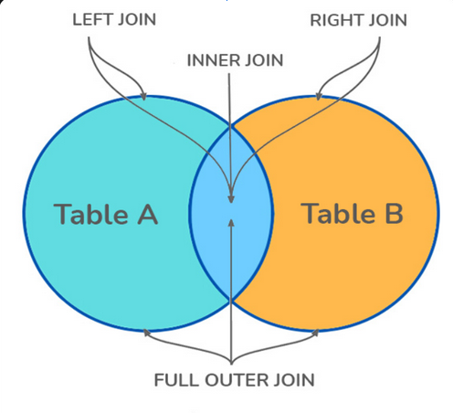
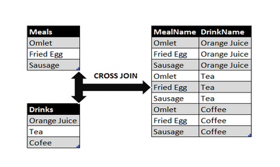

# SQL Interview Questions

## Database Fundamentals

1. ### **What is Database**

   _An organized collection of data stored and retrieved digitally from
   remote/local systems_

2. ### **What is RDBMS? How is it different from DBMS**

   - **DBMS:** _Software to define, create and maintain databases_
   - **RDBMS:** _Advanced version with relational capabilities (tables,
     relations)_

3. ### **Difference between SQL and MySQL**

   - **SQL:** _Language for RDBMS_
   - **MySQL:** _Specific RDBMS product using SQL_

4. ### **Tables and Fields**
   - **Tables:** _Collections of columns (fields) and rows (records)_
   - **Fields:** _Columns defining data attributes_

## SQL Commands & Operations

5. ### **SQL Command Categories**

   - **DDL:** _Data Definition Language_

     - **Commands:** `CREATE`, `ALTER`, `DROP`, `TRUNCATE`

     - **Purpose:** _Define and modify database schema (tables, indexes, views,
       etc.)_

   - **DML:** _Data Manipulation Language_

     - **Commands:** `INSERT`, `UPDATE`, `DELETE`

     - **Purpose:** _Manage and manipulate the data stored in tables_

   - **DQL:** _Data Query Language_

     - **Command:** `SELECT`

     - **Purpose:** _Query and retrieve data from database tables_

   - **TCL:** _Transaction Control Language_

     - **Commands:** `COMMIT`, `ROLLBACK`, `SAVEPOINT`

     - **Purpose:** _Manage transactions in the database (make them permanent or
       undo them)_

   - **DCL:** _Data Control Language_

     - **Commands:** `GRANT`, `REVOKE`

     - **Purpose:** _Manage permissions and access control for database users_

6. ### **SELECT Statement Fundamentals**

   - Retrieves data from tables
   - Common clauses:
     - **WHERE** _(filtering)_
     - **ORDER BY** _(sorting_)
     - **GROUP BY** _(aggregation)_
     - **HAVING** _(filter groups)_

7. ### **Pattern Matching**

   _Uses **LIKE/ILIKE** with wildcards:_

   - **%** (any sequence)
   - **\_** (single character)

     ```sql
     WHERE name LIKE 'J%'
     ```

## Database Objects

8. ### **Creating Table Copies**

   ```sql
   CREATE TABLE new_table AS SELECT * FROM original_table WHERE 1=0;
   ```

9. ### **Views**

   _Saved SQL queries acting as virtual tables_

10. ### **Indexes in PostgreSQL**

    _Indexes in PostgreSQL improve query performance by reducing the amount of
    data scanned. Choosing the right index type depends on the data and query
    patterns._

    - **B-Tree Index (Default)**

      - **Usage:** Default index type, created if you don’t specify.
      - **Best for:** Equality (`=`) and range queries (`<`, `>`, `BETWEEN`,
        `ORDER BY`).
      - **Notes:** Balanced tree structure. Works well for most queries,
        especially when sorted data is needed.

      ```sql
      CREATE INDEX idx_users_email ON users(email);
      ```

    - **Hash Index**

      - **Usage:** Optimized for equality lookups.
      - **Best for:** `=` comparisons only.
      - **Notes:**
        - Doesn’t support range queries.
        - Prior to PostgreSQL 10, not WAL-logged (unsafe for crashes).
        - Now crash-safe and replicated.

      ```sql
      CREATE INDEX idx_users_username_hash ON users USING hash(username);
      ```

    - **Composite Index (Multi-column)**

      - **Usage:** Index on multiple columns.
      - **Best for:** Queries filtering by multiple columns together.
      - **Notes:**
        - Column order matters! Index `(a, b)` can optimize queries on `a` or
          `a+b`, but not `b` alone.

      ```sql
      CREATE INDEX idx_orders_user_date ON orders(user_id, order_date);
      ```

    - **Partial Index**

      - **Usage:** Index only a subset of rows (with a condition).
      - **Best for:** When only part of the data is queried frequently.
      - **Notes:**
        - Saves space and improves performance.
        - Great for queries with common filters.

      ```sql
      CREATE INDEX idx_active_users ON users(email) WHERE active = true;
      ```

    - **BRIN (Block Range Index)**

      - **Usage:** Stores summaries of block ranges, not every row.
      - **Best for:** Very large, naturally ordered datasets (time-series,
        logs).
      - **Notes:**
        - Extremely space-efficient.
        - Fast for range queries over sequential data.

      ```sql
      CREATE INDEX idx_logs_date_brin ON logs USING brin(log_date);
      ```

    - **GIN (Generalized Inverted Index)**

      - **Usage:** Index for composite values like arrays, JSONB, full-text.
      - **Best for:** `@>`, `?`, full-text search.
      - **Notes:**
        - Slower writes, faster complex lookups.
        - Ideal for JSONB and text search.

      ```sql
      CREATE INDEX idx_docs_content_gin ON documents USING gin(to_tsvector('english', content));
      ```

    - **GiST (Generalized Search Tree)**

      - **Usage:** Flexible index supporting custom data types.
      - **Best for:** Geospatial, full-text search, ranges.
      - **Notes:**
        - Used by PostGIS for GIS queries.
        - Handles nearest-neighbor searches.

      ```sql
      CREATE INDEX idx_points_gist ON points USING gist(location);
      ```

    - **SP-GiST (Space-partitioned GiST)**

      - **Usage:** Supports partitioned data structures like quadtrees, k-d
        trees.
      - **Best for:** Non-balanced partitioned data (geospatial, IP ranges).
      - **Notes:**
        - Efficient for hierarchical or partitioned data.

      ```sql
      CREATE INDEX idx_network_spgist ON networks USING spgist(ip_range);
      ```

    - **✅ Summary Table**

      | Index Type    | Best For                   | Example Use Case                |
      | ------------- | -------------------------- | ------------------------------- |
      | **B-Tree**    | Equality, ranges, sorting  | Email lookups, ORDER BY queries |
      | **Hash**      | Equality only              | Lookup by exact username        |
      | **Composite** | Multi-column filters       | `WHERE user_id=.. AND date=..`  |
      | **Partial**   | Filtered subset of rows    | Active users, non-null fields   |
      | **BRIN**      | Large, sequential data     | Logs, time-series               |
      | **GIN**       | Arrays, JSONB, text search | Full-text search, tags          |
      | **GiST**      | Custom / geometric data    | Geospatial queries, ranges      |
      | **SP-GiST**   | Partitioned structures     | IP ranges, hierarchical data    |

---

## Constraints & Keys

11. ### **Primary Key**

    _Uniquely identifies rows (UNIQUE + NOT NULL)_

12. ### **Foreign Key**

    _References primary key in another table_

13. ### **UNIQUE Constraint**

    _Ensures column values are distinct_

14. ### **Common Constraints**
    ```sql
    NOT NULL, CHECK, DEFAULT, UNIQUE, PRIMARY KEY, FOREIGN KEY
    ```

## Joins & Relationships

15. ### **Join Types**

    

    - **INNER:** _Matching rows only_
    - **LEFT/RIGHT:** _All rows from one side_
    - **FULL:** _All rows from both_
    - **CROSS:** _Cartesian product_ 
    - **SELF:** _Join table to itself_

16. ### **Table Relationships**
    - One-to-One
    - One-to-Many
    - Many-to-Many
    - Self-Referencing

## Advanced Queries

17. ### **Subqueries**

    Nested queries used in:

    - **WHERE** clauses
    - **FROM** clauses
    - **SELECT** expressions

18. ### **Set Operations**
    - **UNION:** _Combine results_
    - **INTERSECT:** _Common rows_
    - **MINUS/EXCEPT:** _Row differences_

## Data Modification

19. ### **Data Modification Commands**

    - **INSERT:** _Add new rows_
    - **UPDATE:** _Modify existing rows_
    - **DELETE:** _Remove rows_
    - **TRUNCATE:** _Empty table_
    - **DROP:** _Remove table_

20. ### **Column Modification**
    ```sql
    ALTER TABLE table_name
    ALTER COLUMN column_name TYPE new_data_type;
    ```

## PostgreSQL Specifics

21. ### **Database Management**

    - **CREATE DATABASE:** _New database_
    - **\l:** _List all databases_

22. ### **ACID Compliance**

    PostgreSQL fully supports:

    - **Atomicity**
    - **Consistency**
    - **Isolation**
    - **Durability**

23. ### **Commit vs Checkpoint**
    - **Commit:** _Finalizes transaction_
    - **Checkpoint:** _Writes changes to disk_

## Database Design

24. ### **Data Normalization**

    Process to:

    - Reduce redundancy
    - Improve integrity  
      Through normal forms (1NF, 2NF, 3NF etc.)

25. ### **Aliases**
    _Temporary names for columns/tables:_
    ```sql
    SELECT col AS alias FROM table t;
    ```

## Functions

26. ### **Aggregate Functions**

    _Operate on value sets:_

    ```sql
    COUNT(), SUM(), AVG(), MAX(), MIN()
    ```

27. ### **Scalar Functions**
    _Single-value operations:_
    ```sql
    UPPER(), LOWER(), ROUND(), NOW()
    ```
