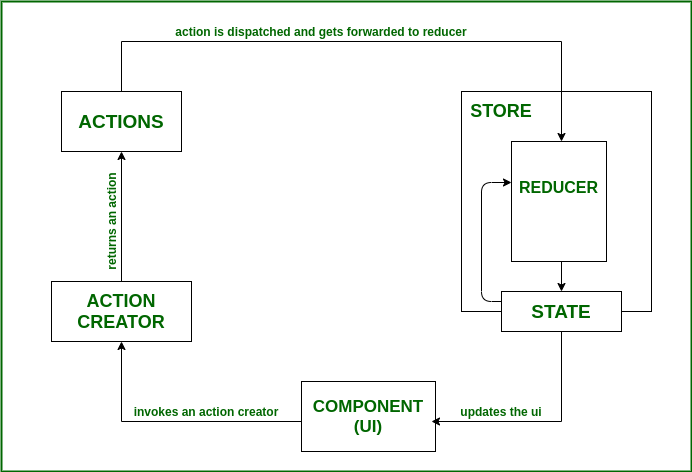

# Redux State Management Interview Questions

1. ## **What is Redux?**

   _**Redux** is a popular open-source state management library for JavaScript
   applications. It provides a way to centralize the state of an application in
   a single store, making it easier to debug, test, and reason about the state
   changes in the application._

2. ## **What are the problems that Redux solves?**

   _Redux solves several challenges in complex front-end applications:_

   - **State Management:** Centralized application state.
   - **Predictable State Changes:** Unidirectional data flow for clarity.
   - **Debugging:** Redux DevTools for inspecting state history.
   - **Asynchronous Logic:** Handles async tasks via middleware like Redux
     Thunk/Saga.
   - **Time Travel & Undo/Redo:** Tracks state history for time travel
     debugging.

3. ## **What are the advantages of Redux in React?**

   - **Centralized State Management:** Redux stores state globally, accessible
     by all components.
   - **Performance Optimizations:** Prevents unnecessary re-renders by updating
     only changed data.
   - **Pure Reducer Functions:** State changes are handled by pure functions,
     returning a new object.
   - **Storing Long-Term Data:** Redux preserves data across page refreshes.
   - **Supportive Community:** A large community provides resources, best
     practices, and support.
   - **Reduces Code Complexity:** Centralized state simplifies the code and
     eliminates confusion.
   - **Easier Maintainability:** A single store makes state updates easier to
     manage.
   - **Reduces Time:** React-Redux updates only the changed parts, not the
     entire page.
   - **Effortless Debugging:** Pure reducer functions simplify logic and
     debugging.

4. ## **What is the difference between Redux and Context API?**

   | Features                      | Redux                                           | Context API                        |
   | ----------------------------- | ----------------------------------------------- | ---------------------------------- |
   | **Middleware**                | Middlewares present                             | Middlewares absent                 |
   | **State management approach** | Centralized                                     | Decentralized                      |
   | **Data Flow**                 | Unidirectional flow of data                     | Bidirectional flow of data         |
   | **API**                       | Actions, reducers, middleware                   | Context.Provider, Context.Consumer |
   | **Debugging**                 | Dedicated Redux development tools for debugging | No tools for debugging             |

5. ## **Is it necessary to keep all the component states in the Redux store?**

   - No, it's not necessary to keep all component states in the Redux store.
   - While Redux provides a centralized state management solution, it's not
     meant to replace local component state entirely.
   - There are several factors to consider when deciding whether to use Redux
     for a particular piece of state.

6. ## **How do you connect a React component to a Redux store?**

   _The `connect()` function connects a React component to a Redux store. It
   provides its connected component with the pieces of the data it needs from
   the store, and the functions it can use to dispatch actions to the store._

   ```tsx
   import React from 'react'
   import { connect } from 'react-redux'

   const Counter = ({ count, increment, decrement }) => (
     <div>
       <h2>Counter: {count}</h2>
       <button onClick={increment}>Increment</button>
       <button onClick={decrement}>Decrement</button>
     </div>
   )

   const toProps = state => ({ count: state.counter.count })

   const dispachProps = dispatch => ({
     increment: () => dispatch({ type: 'INCREMENT' }),
     decrement: () => dispatch({ type: 'DECREMENT' })
   })

   export default connect(toProps, dispachProps)(Counter)
   ```

7. ## **Explain the difference between Redux and React's local state**

   | Features           | Redux                           | React's Local State               |
   | ------------------ | ------------------------------- | --------------------------------- |
   | **Scope**          | Application-wide                | Component-specific                |
   | **Access**         | Accessed by multiple components | Accessed only by the component    |
   | **Data Flow**      | Unidirectional                  | Component-centric                 |
   | **Scalability**    | Suitable for large-scale apps   | Suitable for small to medium apps |
   | **Learning Curve** | Steeper                         | Easier                            |

8. ## **What are pure functions in the context of Redux?**

   _A pure function is defined as
   `any function that doesn't alter input data, doesn't depend on the external state, and can consistently provide the same output for the same input`.
   As opposed to React, Redux depends on such pure functions._

9. ## **What are the key components of Redux architecture?**

   - **Actions:** Actions are a plain JavaScript object that contains
     information. Actions are the only source of information for the store.
     Actions have a type field that tells what kind of action to perform and all
     other fields contain information or data.
   - **Reducers:** Reducers are the pure functions that take the current state
     and action and return the new state and tell the store how to do.
   - **Store:** The store is the object which holds the state of the
     application.

10. ## **What is the purpose of the Redux store?**

    _The Redux store is a centralized object that holds the state of the
    application. It allows components to access and update the state using
    dispatch and selectors. The state inside the store can only be modified by
    dispatching actions_

    **Key Functions of the Redux Store:**

    - **createStore(reducer):** Creates a Redux store using a reducer function.
    - **dispatch(action):** Sends an action to the store to update the state.
    - **getState():** Retrieves the current state of the store.

11. ## **What’s the typical flow of data like in a React with Redux app ?**

    - **User Interaction:** Triggers an action in the component.
    - **Action Dispatch:** The action is sent to the Redux store.
    - **Reducers Update State:** The root reducer processes the action, updating
      the state by returning a new copy.
    - **Store Updates Components:** The store notifies subscribed components,
      which then re-render with the new state.

    

12. ## **What are actions in Redux?**

    _Actions in Redux are plain JavaScript objects that contain information
    about an event that occurred in the application. They are the only way to
    send data to the Redux store and trigger state updates._

    _Each action must have a type property that describes the event, and it can
    optionally carry a payload with additional data._

13. ## **What are reducers in Redux?**

    _In Redux, reducers are pure functions that handle state logic, accepting
    the initial state and action type to update and return the state,
    facilitating changes in React view components._

    ```tsx
    const counterReducer = (state = { count: 0 }, action) => {
      switch (action.type) {
        case 'INCREMENT':
          return { count: state.count + 1 }
        default:
          return state
      }
    }
    ```

14. ## **What is the purpose of the Provider component in React Redux?**

    - The **Provider** component **makes the Redux store available to any nested
      components that need to access the Redux store**.
    - Since any React component in a React Redux app can be connected to the
      store, most applications will render a `<Provider>` at the top level, with
      the entire app's component tree inside of it.

15. ## **What is the role of the dispatch function in Redux?**

    - The role of the dispatch function in Redux is to send actions to the
      store.
    - It's a method provided by the Redux store that accepts an action object as
      its argument and initiates the process of updating the application's state
      based on that action.

16. ## **What is Redux middleware?**

    - Redux middleware is a piece of software that works between the action
      creators and the reducers in a Redux application.
    - It intercepts actions before they reach the reducers, and allows to
      perform asynchronous operations, modify actions, or implement custom
      behavior.

17. ## **Describe the role of middleware in Redux.**

    _Middleware in Redux is like a gatekeeper that stands between the actions
    you dispatch in your app and the part of Redux responsible for updating the
    state. It's is used to catch these actions before they go to the state
    updates and do some extra stuff with them. For example, it can check if a
    user is authenticated or not before giving the permissions._

18. ## **What are action chaining in Redux middleware?**

    _Action chaining in Redux middleware refers to the process of dispatching
    multiple actions in response to a single dispatched action. This technique
    is often used to handle complex sequences of actions or to arrange multiple
    asynchronous operations._

19. ## **What do you understand about the Redux Saga?**

    _Redux-Saga is a library that aims to make application side effects (i.e.,
    asynchronous things like data fetching and impure things like accessing the
    browser cache) easier to manage, more efficient to execute, easy to test,
    and better at handling failures._

20. ## **Explain the purpose of the `redux-thunk` middleware**

    - The purpose of the `redux-thunk` middleware is to enable Redux to handle
      asynchronous logic more easily, particularly when dealing with actions
      that don't immediately return an object, but instead return a function.
    - `Redux-thunk` extends Redux functionality by allowing action creators to
      return functions instead of plain action objects.
    - These functions, known as thinks and have access to the `dispatch` and
      `getState` functions of the Redux store.

21. ## **What are selectors in Redux?**

    _**Selectors** in Redux are the functions that extract specific pieces of
    data from the Redux store state. They provide a way to pass the data from
    the state in an efficient manner. Selectors are mainly used to encapsulate
    the process of accessing and transforming state data which makes it easier
    to manage and reuse across multiple components._

22. ## **Explain the concept of "container components" in React Redux.**

    - Container components are React components that are responsible for
      interacting with the Redux store.
    - They are connected to the Redux store using the connect() function.
    - Container components acts as the bridge between the Redux store and
      presentational components, providing them with the necessary data from the
      store and actions to dispatch.

23. ## **What are "presentational components" ?**

    _Presentational components, also known as stateless components, are React
    components that are used for rendering UI elements based on the props they
    receive. They are responsible for presenting data to the user and typically
    do not have any dependencies on the application's state or logic._
