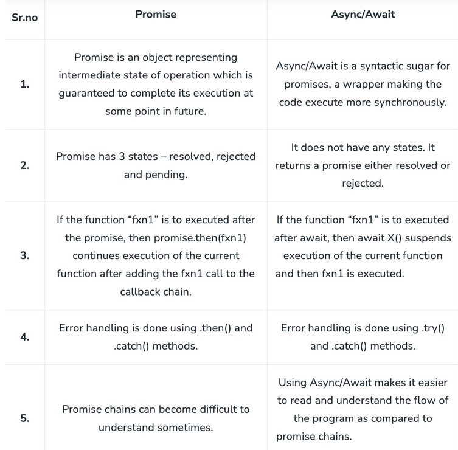

# **Javascript interview questions**

1. ## **Is JavaScript a compiled or interpreted language**
   _JavaScript is primarily interpreted but uses Just-In-Time (JIT) compilation
   for optimization:_
   - Code is interpreted line-by-line at runtime
   - Modern engines compile to optimized bytecode
   - Combines benefits of both approaches
2. ## **What paradigm is Javascript**

   _JavaScript is a multi-paradigm language supporting:_

   | Paradigm   | Description                     | Example                        |
   | ---------- | ------------------------------- | ------------------------------ |
   | Imperative | Step-by-step instructions       | Loops, if statements           |
   | OOP        | Prototype-based inheritance     | Constructor functions, classes |
   | Functional | First-class functions, closures | Array.map(), callbacks         |

3. ## **Why do we call javascript a dynamic language**

   - Variables can hold any data type
   - Types are determined at runtime
   - No compile-time type checking

   ```js
   let value = 10 // Number
   value = 'hello' // Now String
   value = { id: 1 } // Now Object
   ```

4. ## **Is JavaScript a pass-by-reference or pass-by-value language**

   _JavaScript is always pass-by-value, but:_

   - Primitives pass the actual value
   - Objects pass a copy of the reference

   ```js
   // Primitive (value copied)
   function change(num) {
     num = 10
   }
   let x = 5
   change(x) // x remains 5

   // Object (reference copied)
   function update(obj) {
     obj.prop = 'changed'
   }
   let item = { prop: 'original' }
   update(item) // item.prop now "changed"
   ```

5. ## **What are the different data types present in javascript**

   - **Primitive Types:**

     - String, Number, Boolean
     - Null, Undefined
     - Symbol, BigInt (ES6+)

   - **Non-Primitive Types:**
     - Object
     - Array, Map, Set (specialized objects)

6. ## **What are the differences between primitives and non-primitives**

   | Characteristic | Primitives     | Non-Primitives     |
   | -------------- | -------------- | ------------------ |
   | Mutability     | Immutable      | Mutable            |
   | Storage        | By value       | By reference       |
   | Comparison     | Value equality | Reference equality |
   | Methods        | No methods     | Have methods       |

7. ## **What is Symbol primitive**

   _Unique identifiers used for:_

   - Creating unique object properties
   - Avoiding naming collisions
   - Defining well-known symbols

   ```js
   const id = Symbol('unique identifier')
   const user = {
     [id]: '123', // Hidden property
     name: 'John'
   }
   ```

8. ## **Let, const vs var**

   | Feature       | var             | let         | const       |
   | ------------- | --------------- | ----------- | ----------- |
   | Scope         | Function        | Block       | Block       |
   | Hoisting      | Yes (undefined) | Yes (TDZ)   | Yes (TDZ)   |
   | Reassignment  | Allowed         | Allowed     | Not allowed |
   | Redeclaration | Allowed         | Not allowed | Not allowed |

   ```js
   var x = 1 // Function-scoped
   let y = 2 // Block-scoped
   const z = 3 // Block-scoped constant
   ```

9. ## **What is the Temporal Dead Zone**

   _The **Temporal Dead Zone (TDZ)** is a behavior in JavaScript where variables
   declared with `let` and `const` cannot be accessed before their declaration.
   Attempting to do so throws a `ReferenceError`_

   ```js
   console.log(x) // ReferenceError (TDZ)
   let x = 10
   ```

   **Key Points:**

   - Only applies to `let` and `const` (not `var`).
   - TDZ ends once the variable is declared.

10) ## **What is the precedence order between local and global variables**

    _A **local variable** takes precedence over a **global variable** with the
    same name_

    ```js
    let name = 'Global'
    function greet() {
      let name = 'Local'
      console.log(name) // "Local" (local overrides global)
    }
    greet()
    ```

11. ## **Can I redeclare let and const variables**

    - **`var`:** _Yes redeclaration is possible_
    - **`let`:** _No redeclaration in the same scope._
    - **`const`:** _No redeclaration or reassignment._

    ```js
    let a = 1
    let a = 2 // SyntaxError

    const b = 1
    const b = 2 // SyntaxError

    var c = 1
    var c = 2 // c is equal to 2
    ```

12. ## **Does const variable make the value immutable**

    _No, `const` only prevents **reassignment** of the variable. For
    objects/arrays, properties/elements can still be modified_

    ```js
    const arr = [1, 2]
    arr.push(3) // Works
    arr = [4, 5] // TypeError
    ```

13. ## **Explain Scope and Scope Chain in javascript**

    **Scope** determines variable accessibility. Types:

    1. **Global:** Accessible everywhere.
    2. **Function/Local:** Accessible only inside the function.
    3. **Block:** Limited to `{}` (only for `let`/`const`).

    **Scope Chain:** JavaScript looks for variables up the nested scopes (from
    inner to outer).

    ```js
    let global = 'G'
    function outer() {
      let outerVar = 'O'
      function inner() {
        console.log(outerVar) // "O" (via scope chain)
      }
      inner()
    }
    ```

14. ## **Scope and Lexical environment in js**

    - **Lexical Environment:** _A Lexical Environment is like a storage system
      that keeps track of variables and their values during execution_
    - **Scope:** _Scope defines where a variable can be accessed in the code.
      There are different types of scope_

    | **Lexical Environment**          | **Scope**                      |
    | -------------------------------- | ------------------------------ |
    | Storage for variables/functions. | Rules for variable access.     |
    | Includes a reference to parent.  | Defines visibility boundaries. |

    ```js
    function parent() {
      let x = 10 // Stored in parent's lexical environment
      function child() {
        console.log(x) // Accessed via scope chain
      }
      child()
    }
    ```

15. ## **What are global variables**

    _Variables declared without `let`/`const`/`var` or in the global scope_

    ```js
    function foo() {
      globalVar = 10 // Becomes global
    }
    foo()
    console.log(globalVar) // 10
    ```

16. ## **What are the problems with global variables**
    - **Naming collisions** _(local vs. global)._
    - **Unpredictable modifications** _across scripts._
    - **Harder to debug** _(no isolation)._
17. ## **What are template literals**

    _Strings with embedded expressions using backticks (`)_

    ```js
    let name = 'Alice'
    console.log(`Hello, ${name}!`) // "Hello, Alice!"
    ```

18. ## **Difference between “ \== “ and “ \=== “ operators**

    | **`==` (Loose Equality)** | **`===` (Strict Equality)** |
    | ------------------------- | --------------------------- |
    | Converts types if needed. | No type conversion.         |
    | 5 == "5" → `true`         | 5 === "5" → `false`         |

    ```js
    console.log(0 == false) // true (type coercion)
    console.log(0 === false) // false
    ```

19. ## **Explain Implicit Type Coercion in javascript**

    _JavaScript automatically converts types in certain operations_

    - **String Coercion:** _`+` with strings converts all operands to strings_.

      ```js
      console.log('5' + 2) // "52"
      ```

    - **Boolean Coercion:** _Falsy values (`0`, `""`, `null`, `undefined`,
      `NaN`, `false`) become `false`_.

      ```js
      if (0) {
        console.log('Runs')
      } // Skipped
      ```

    - **Logical Operators:**

      - `||` _returns the first truthy value._
      - `&&` _returns the last truthy value if all are truthy._

      ```js
      console.log(0 || 'Hello') // "Hello"
      ```

    - **Equality Coercion:**
      - `==` _converts types before comparison._
      - `===` _checks type and value._
      ```js
      console.log(12 == '12') // true
      ```

20. ## **What is an Unary operator**

    _The unary `+` operator converts a variable to a number. If conversion
    fails, it returns `NaN`._

    ```js
    console.log(+'10') // 10 (number)
    console.log(+'Hello') // NaN
    ```

21. ## **What is the output of prepend additive operator on falsy values**

    _Using `+` on falsy values (`null`, `undefined`, `false`, `""`) converts
    them to `0`_

    ```js
    console.log(+null) // 0
    console.log(+false) // 0
    ```

22. ## **What is the rest parameter and spread operator**

    | **Rest Parameter (`...args`)**             | **Spread Operator (`...iterable`)**         |
    | ------------------------------------------ | ------------------------------------------- |
    | Collects function arguments into an array. | Expands iterables into individual elements. |
    | Must be the last parameter.                | Works in arrays/objects/function calls.     |

    - **Rest:**

    ```js
    function sum(...nums) {
      return nums.reduce((a, b) => a + b)
    }
    console.log(sum(1, 2, 3)) // 6
    ```

    - **Spread:**

    ```js
    const arr1 = [1, 2]
    const arr2 = [...arr1, 3] // [1, 2, 3]
    ```

23. ## **What is an arguments object**

    _An array-like object holding function arguments. Cannot use array methods
    directly._

    ```js
    function showArgs() {
      console.log(arguments[0]) // First argument
      const argsArray = [...arguments] // Convert to array
    }
    showArgs(1, 'a')
    ```

    **Note:** Use rest parameters (`...args`) instead for modern code.

24. ## **What happens with negating an array**

    _Arrays are truthy, so negating them with `!` returns `false`._

    ```js
    console.log(![]) // false
    ```

25. ## **What happens if we add two arrays**

    _Arrays are converted to strings and concatenated._

    ```js
    console.log([1, 2] + [3]) // "1,23"
    ```

26. ## **What are the placeholders from the console object**

    | **Placeholder** | **Purpose**              |
    | --------------- | ------------------------ |
    | `%o`            | Object                   |
    | `%s`            | String                   |
    | `%d`            | Number (integer/decimal) |

    ```js
    console.log('Name: %s, Age: %d', 'Alice', 25)
    ```

27. ## **What is NaN property in JavaScript**

    - **NaN** ("Not a Number") results from invalid math operations.
    - Use `isNaN()` to check for NaN.

    ```js
    console.log(10 - 'Hello') // NaN
    console.log(isNaN('123')) // false (coercible to number)
    ```

28. ## **Explain WeakSet in javascript**

    - Holds **objects weakly** (garbage collected if no other references).
    - Methods: `add()`, `delete()`, `has()`.

    ```js
    const weakSet = new WeakSet()
    let obj = {}
    weakSet.add(obj)
    console.log(weakSet.has(obj)) // true
    obj = null // Removed from WeakSet automatically
    ```

    **Key Difference vs. Set:**

    - WeakSet only stores objects.
    - No iteration/size methods.

29. ## **Weakset vs Set**

    | Feature            | WeakSet                     | Set                                |
    | ------------------ | --------------------------- | ---------------------------------- |
    | Values             | Only objects                | Any data type                      |
    | Garbage Collection | Allows GC (no memory leaks) | Prevents GC (strong references)    |
    | Iteration          | No iteration methods        | Has forEach/entries/keys/values    |
    | Size Tracking      | No .size property           | Has .size property                 |
    | Use Case           | Tracking object existence   | General-purpose unique collections |

    ```js
    let obj = {}
    const weakSet = new WeakSet()
    weakSet.add(obj) // Only accepts objects
    ```

    ```js
    const set = new Set()
    set.add(5) // Accepts any value
    set.add('hello')
    ```

30. ## **Explain WeakMap in javascript**

    _Similar to WeakSet but stores key-value pairs (keys must be objects).
    Values are weakly referenced._

    ```js
    let keyObj = {}
    const weakMap = new WeakMap()
    weakMap.set(keyObj, 'secret data')
    console.log(weakMap.get(keyObj)) // "secret data"
    keyObj = null // Entry automatically removed
    ```

31. ## **Null vs Undefined**

    | Null                         | Undefined                          |
    | ---------------------------- | ---------------------------------- |
    | Intentional absence of value | Variable declared but not assigned |
    | Type: object                 | Type: undefined                    |
    | Must be explicitly set       | Default state of variables         |

    ```js
    let a // undefined
    let b = null // explicitly null

    // Common undefined scenarios:
    function test(x) {
      console.log(x)
    }
    test() // undefined

    // Null use case:
    document.getElementById('nonexistent') // returns null
    ```

    **Difference between undefined and undeclared**

    | Undeclared                           | Undefined                               |
    | ------------------------------------ | --------------------------------------- |
    | Not exist/declared                   | Declared but not assigned               |
    | Error while reading undeclared value | Undefined while reading undefined value |

32. ## **What is global execution context**

    _The default context created when JavaScript code first runs:_

    - Creates global object (window in browsers)
    - Sets `this` to the global object
    - All non-function code executes here

    ```js
    console.log(this === window) // true (in browser)
    var globalVar = "I'm global"
    ```

33. ## **What is function execution context**

    _Created each time a function is called:_

    - Has its own variable environment
    - Contains `arguments` object
    - `this` depends on invocation

    ```js
    function greet(name) {
      console.log(`Hello ${name}`)
    }
    greet('Alice') // New execution context created
    ```

34. ## **What is the job of ‘this’ keyword**

    _Behavior depends on context:_

    | Context               | `this` Value                  | Example                             |
    | --------------------- | ----------------------------- | ----------------------------------- |
    | Global                | Global object (window/global) | console.log(this);                  |
    | Function (non-strict) | Global object                 | function f() { console.log(this); } |
    | Method                | Owner object                  | obj.method = function() { this };   |
    | Constructor           | New instance                  | new Constructor();                  |
    | Arrow Function        | Inherits from parent scope    | () => { console.log(this); }        |

35. ## **What is a strict mode in javascript**

    _Enables stricter parsing and error handling:_

    - Prevents accidental globals
    - Makes assignments to read-only properties throw errors
    - Requires unique parameter names

    ```js
    'use strict'
    undeclaredVar = 10 // Throws ReferenceError
    delete Object.prototype // Throws TypeError
    ```

36. ## **What is Hoisting**

    _JavaScript's behavior of moving declarations to the top:_

    - `var`: Hoisted and initialized with `undefined`
    - `let/const`: Hoisted but not initialized (TDZ)
    - Functions: Fully hoisted

    ```js
    console.log(x) // undefined (var)
    var x = 5

    console.log(y) // ReferenceError (let)
    let y = 10
    ```

37. ## **What is an IIFE (Immediately Invoked Function Expression)**

    _Self-executing anonymous function for data privacy:_

    ```js
    ;(function () {
      let privateVar = 'secret'
      console.log(privateVar) // "secret"
    })()

    console.log(privateVar) // ReferenceError

    // Modern alternative (block scope):
    {
      let privateVar = 'secret'
      console.log(privateVar) // Works
    }
    ```

38. ## **What is a first class function**

    _Functions treated like any other variable:_

    1. Can be assigned to variables
    2. Can be passed as arguments
    3. Can be returned from functions

    ```js
    // 1. Variable assignment
    const greet = function () {
      return 'Hello'
    }

    // 2. Argument passing
    function wrapper(fn) {
      return fn()
    }
    wrapper(greet) // "Hello"

    // 3. Returning functions
    function multiplier(factor) {
      return function (x) {
        return x * factor
      }
    }
    const double = multiplier(2)
    double(5) // 10
    ```

39. ## **What is a first order function**

    _A function that:_

    - Does **not** accept another function as an argument
    - Does **not** return a function

    ```js
    function square(x) {
      return x * x // Takes number, returns number
    }
    ```

40. ## **What is a higher order function**

    _A function that:_

    - Accepts a function as an argument **OR**
    - Returns a function **OR**
    - Both

    ```js
    function repeat(fn, n) {
      for (let i = 0; i < n; i++) fn()
    }
    repeat(() => console.log('Hi'), 3) // Logs "Hi" 3 times
    ```

    ```js
    function multiplier(factor) {
      return x => x * factor // Returns new function
    }
    const double = multiplier(2)
    double(5) // 10
    ```

41. ## **What is a unary function**

    A function that accepts exactly **one argument**.

    ```js
    const identity = x => x // Single parameter
    console.log(identity(5)) // 5
    ```

42. ## **What is a pure function**

    _Function is pure if:_

    1. Same input **always** produces same output
    2. No side effects (doesn't modify external state)

    ```js
    function add(a, b) {
      return a + b // Predictable, no side effects
    }
    ```

    ```js
    let counter = 0
    function increment() {
      counter++ // Modifies external state
    }
    ```

43. ## **What is memoization**

    _Caching function results to optimize performance._

    ```js
    function memoize(fn) {
      const cache = {}
      return arg => {
        if (cache[arg]) return cache[arg]
        const result = fn(arg)
        cache[arg] = result
        return result
      }
    }

    const fastFactorial = memoize(n => {
      return n <= 1 ? 1 : n * fastFactorial(n - 1)
    })
    ```

44. ## **Memory Management in JavaScript**

    - **Automatic garbage collection**
    - **Mark-and-sweep algorithm** (removes unreachable objects)
    - **Memory leaks** occur when:
      - Global variables accumulate
      - Forgotten timers/callbacks
      - DOM references persist

    ```js
    function createLeak() {
      window.leak = new Array(1000000) // Global variable
    }
    ```

    [https://www.geeksforgeeks.org/memory-management-in-javascript/](https://www.geeksforgeeks.org/memory-management-in-javascript/)

45. ## **What is an async function**

    _Declared with `async` keyword, enables `await` syntax._

    ```js
    async function fetchData() {
      try {
        const response = await fetch('api/data')
        return response.json()
      } catch (error) {
        console.error('Fetch failed:', error)
      }
    }
    ```

46. ## **What is the use of promises in javascript**

    _Promises are used to handle asynchronous operations in javascript. Before
    them callbacks were used to handle asynchronous operations but due to the
    limited functionality of callbacks, using multiple callbacks leads to
    unmanageable code_

    - **States:**
      - **Pending:** _Initial state_
      - **Fulfilled:** _This state represents that the async operation is
        completed_
      - **Rejected:** _This state represents that the async operation is failed_
      - **Settled:** _This state represents that the async operation is either
        Fulfilled or Rejected_
    - **Paramters:**
      - **Resolve:** _means all good and success_
      - **Reject:** _means something is bad and error_

    | Method                  | Description                                    |
    | ----------------------- | ---------------------------------------------- |
    | `.then()`               | Handles fulfillment                            |
    | `.catch()`              | Handles rejection                              |
    | `.finally()`            | Runs regardless of outcome                     |
    | `.reject()`             | Rejects (error)                                |
    | `.resolve()`            | Resolves (ok)                                  |
    | `.try()`                | Wraps the result with Promise                  |
    | `.withResolvers()`      | New Promise with resolve/reject                |
    | `.then().then().then()` | Chained Promise                                |
    | `Promise.all()`         | Fails fast on first rejection                  |
    | `Promise.allSettled()`  | Returns Promise with every result (ok/bad)     |
    | `Promise.race()`        | Returns first settled Promise                  |
    | `Promise.any()`         | Returns error when all fails otherwise Promise |

    ```js
    const promise = new Promise((resolve, reject) => {
      setTimeout(() => resolve('Done!'), 1000)
    })
    promise.then(console.log) // "Done!" after 1s
    ```

    _More about
    [Promises](https://www.deepintodev.com/blog/how-promises-work-in-javascript)_

47. ## **What are callbacks**

    _Functions passed as arguments to be executed later_

    ```js
    function fetchData(callback) {
      setTimeout(() => callback('Data loaded'), 500)
    }
    fetchData(data => console.log(data)) // Logs after 500ms
    ```

48. ## **Callback vs Promise vs Async/Await**

    | Feature         | Callbacks         | Promises           | Async/Await           |
    | --------------- | ----------------- | ------------------ | --------------------- |
    | Readability     | Callback hell     | Chained `.then()`  | Synchronous-like      |
    | Error Handling  | Nested `if (err)` | `.catch()`         | `try/catch`           |
    | Composition     | Difficult         | `.all()`/`.race()` | `await Promise.all()` |
    | Browser Support | All versions      | ES6+               | ES8+                  |

    ```js
    // Callback
    getData(a => {
      getMoreData(a, b => {
        console.log(b)
      })
    })

    // Promise
    getData()
      .then(a => getMoreData(a))
      .then(console.log)

    // Async/Await
    const a = await getData()
    const b = await getMoreData(a)
    console.log(b)
    ```

    

49. ## **Synchron vs Asynchron vs Parallel**

    | Type             | Execution Flow              | Key Features                | Use Cases                    |
    | ---------------- | --------------------------- | --------------------------- | ---------------------------- |
    | **Synchronous**  | Line-by-line execution      | Blocks further execution    | Simple scripts, calculations |
    | **Asynchronous** | Non-blocking with callbacks | Uses promises/async-await   | API calls, file operations   |
    | **Parallel**     | Multi-threaded execution    | Web Workers/Child Processes | CPU-intensive tasks          |

    ```js
    // Synchronous
    console.log('First')
    console.log('Second') // Executes after "First"
    ```

    ```js
    // Asynchronous
    console.log('Start')
    setTimeout(() => console.log('Middle'), 0)
    console.log('End') // Logs: Start → End → Middle
    ```

50. ## **What is a callback hell**

    _Deeply nested callbacks making code hard to read/maintain_

    ```js
    getData(a => {
      getMoreData(a, b => {
        getEvenMore(b, c => {
          console.log(c) // Pyramid of doom
        })
      })
    })
    ```

    **Solution:** Promises or async/await

51. ## **What is callback in callback**

    _Sequential execution of async operations via nesting._

    ```js
    function login(user, pass, callback) {
      authenticate(user, pass, token => {
        getUserData(token, data => {
          callback(data) // Nested callback
        })
      })
    }
    ```

52. ## **Why do we use callbacks**

    - Handle async operations (file I/O, API calls)
    - Event handling (click handlers, timers)
    - Custom control flow

    ```js
    button.addEventListener('click', () => {
      console.log('Clicked!') // Callback executes on event
    })
    ```

53. ## **What is observables**

    Streams of values over time (via RxJS library).

    ```js
    import { Observable } from 'rxjs'

    const observable = new Observable(subscriber => {
      subscriber.next(1)
      setTimeout(() => subscriber.next(2), 1000)
    })

    observable.subscribe(value => console.log(value)) // Logs: 1 → (1s later) 2
    ```

    

54. ## **What are the differences between promises and observables**

    | Feature      | Promise                  | Observable                |
    | ------------ | ------------------------ | ------------------------- |
    | Values       | Single value             | Multiple values over time |
    | Cancellation | No native cancellation   | Unsubscribe available     |
    | Chaining     | .then() chains           | Operator pipelines        |
    | Eager/Lazy   | Eager (runs immediately) | Lazy (on subscribe)       |

    

55. ## **What are generator functions**

    _Functions that can pause/resume execution using `yield`._

    ```js
    function* idGenerator() {
      let id = 1
      while (true) {
        yield id++
      }
    }
    const gen = idGenerator()
    console.log(gen.next().value) // 1
    console.log(gen.next().value) // 2
    ```

56. ## **What is an anonymous function**

    _Functions without a name, often used as callbacks._

    ```js
    // As callback
    ;[1, 2, 3].map(function (x) {
      return x * 2
    })

    // Arrow function variant
    ;[1, 2, 3].map(x => x * 2)
    ```

57. ## **What is the currying function**

    _Converting multi-argument functions into nested unary functions._

    ```js
    // Original
    function add(a, b, c) {
      return a + b + c
    }

    // Curried
    function curriedAdd(a) {
      return function (b) {
        return function (c) {
          return a + b + c
        }
      }
    }
    curriedAdd(1)(2)(3) // 6

    // Practical use:
    const add5 = curriedAdd(5)
    const add5And6 = add5(6)
    add5And6(7) // 18
    ```

58. ## **Regular function vs arrow function**

    _In JavaScript, there are two main ways to define functions: regular
    functions (also known as function declarations or function expressions) and
    arrow functions. Each has its own syntax, behavior, and use cases._

    | Feature           | Regular Function  | Arrow Function           |
    | ----------------- | ----------------- | ------------------------ |
    | `this` binding    | Dynamic context   | Lexical (parent) scope   |
    | `arguments`       | Available         | Inherits from parent     |
    | Constructor       | Can be used       | Cannot be used           |
    | Implicit return   | Requires `return` | Single-expression return |
    | Method definition | Works naturally   | May break object context |

    ```js
    const obj = {
      regular: function () {
        console.log(this)
      },
      arrow: () => console.log(this)
    }
    obj.regular() // obj context
    obj.arrow() // Window/global context

    // Example (Implicit return):
    const double = x => x * 2 // No return needed
    ```

59. ## **What is the difference between Function constructor and function declaration**

    | Feature     | Function Constructor    | Function Declaration   |
    | ----------- | ----------------------- | ---------------------- |
    | Scope       | Always global           | Creates closure        |
    | Parsing     | Runtime evaluation      | Hoisted (compile-time) |
    | Security    | Vulnerable to injection | Safer                  |
    | Performance | Slower                  | Faster                 |

    ```js
    // Example (Function Constructor):
    var a = 100
    function createFunction() {
      var a = 200

      return new Function('return a')
    }

    console.log(createFunction()) // 100 not 200

    // Example (Function Declaration):
    var a = 100
    function createFunction() {
      var a = 200

      return function func() {
        return a
      }
    }

    console.log(createFunction()) // 200 not 100
    ```

60. ## **What are closures**

    _A function that remembers its lexical scope even when executed outside it._

    **Scope Chains:**

    1. Own variables
    2. Outer function's variables
    3. Global variables

    ```js
    function counter() {
      let count = 0
      return function () {
        return ++count // Remembers 'count' between calls
      }
    }
    const myCounter = counter()
    console.log(myCounter()) // 1
    console.log(myCounter()) // 2
    ```

61. ## **What is recursion in a programming language**

    _Function that calls itself until a base condition is met._

    ```js
    function factorial(n) {
      return n <= 1 ? 1 : n * factorial(n - 1)
    }
    console.log(factorial(5)) // 120
    ```

62. ## **Explain call(), apply() and bind() methods**

    | Method    | Immediate Execution | Arguments       | Returns            |
    | --------- | ------------------- | --------------- | ------------------ |
    | `call()`  | Yes                 | Comma-separated | Function result    |
    | `apply()` | Yes                 | Array           | Function result    |
    | `bind()`  | No                  | Comma-separated | New bound function |

    ```js
    const person = { name: 'Alice' }

    function greet(greeting) {
      return `${greeting}, ${this.name}!`
    }

    console.log(greet.call(person, 'Hello')) // "Hello, Alice!"
    console.log(greet.apply(person, ['Hi'])) // "Hi, Alice!"

    const boundFn = greet.bind(person, 'Hey')
    console.log(boundFn()) // "Hey, Alice!"
    ```

63. ## **What is the way to find the number of parameters expected by a function**

    Use `function.length` to get expected parameter count.

    ```js
    function sum(a, b, c) {
      return a + b + c
    }
    console.log(sum.length) // 3
    ```

64. ## **What are the types of errors in javascript**

    | Error Type     | Trigger Example                |
    | -------------- | ------------------------------ |
    | SyntaxError    | `function() {}` (missing name) |
    | ReferenceError | `undeclaredVar`                |
    | TypeError      | `null.method()`                |
    | RangeError     | `new Array(-1)`                |
    | URIError       | `decodeURI('%')`               |
    | AggregateError | `Promise.any([rejected])`      |
    | InternalError  | Too much recursion             |

65. ## **What is an error object**

    _Contains error details with:_

    - `name`: Error type
    - `message`: Description

    ```js
    try {
      null.method()
    } catch (err) {
      console.log(err.name) // "TypeError"
      console.log(err.message) // "Cannot read properties of null"
    }
    ```

66. ## **In JavaScript, how many different methods can you make an object**

    1. **Object Literal**  
       `const obj = {};`
    2. **Constructor Function**  
       `new Object()`
    3. **Class Syntax**  
       `class Person {}`
    4. **Object.create()**  
       `Object.create(proto)`
    5. **Factory Function**  
       `function createObj() { return {}; }`

    ```js
    class Car {
      constructor(model) {
        this.model = model
      }
    }
    const myCar = new Car('Tesla')
    ```

67. ## **Object vs Map**

    | Feature     | Object                  | Map                           |
    | ----------- | ----------------------- | ----------------------------- |
    | Key Types   | String/Symbol           | Any value (including objects) |
    | Order       | Not guaranteed          | Insertion order preserved     |
    | Size        | Manual calculation      | `size` property               |
    | Prototype   | Has prototype chain     | No prototype                  |
    | Performance | Faster for simple cases | Better for frequent changes   |

    ```js
    const map = new Map()
    map.set({ id: 1 }, 'Value')
    console.log(map.size) // 1
    ```

68. ## **What is the difference between native, host and user objects**

    | Type       | Source                   | Examples                                         |
    | ---------- | ------------------------ | ------------------------------------------------ |
    | **Native** | ECMAScript specification | `Array`, `Date`, `Math`                          |
    | **Host**   | Runtime environment      | `window`, `document` (browser), `process` (Node) |
    | **User**   | Developer-created        | Custom classes/objects                           |

    ```js
    const user = {
      name: 'Alice',
      age: 30
    }
    ```

69. ## **How do you get the prototype of an object**

    _Use `Object.getPrototypeOf()` to retrieve an object's prototype chain
    link._

    ```js
    const arr = []
    console.log(Object.getPrototypeOf(arr) === Array.prototype) // true
    ```

70. ## **How do you create an object with a prototype**

    _`Object.create()` lets you create new objects with a specific prototype._

    ```js
    const animal = { eats: true }
    const rabbit = Object.create(animal)
    console.log(rabbit.eats) // true (inherited)
    ```

71. ## **How do you set the prototype of one object to another**

    _`Object.setPrototypeOf()` dynamically changes an object's prototype (not
    recommended for performance)._

    ```js
    const rectangle = {
      area() {
        return this.width * this.height
      }
    }
    const square = { width: 5, height: 5 }
    Object.setPrototypeOf(square, rectangle)
    console.log(square.area()) // 25
    ```

72. ## **Do all objects have prototypes**

    _Base objects created with `Object.create(null)` have no prototype_

    ```js
    const bareObject = Object.create(null)
    console.log('toString' in bareObject) // false
    ```

73. ## **How do you determine two values are the same or not using an object**

    _`Object.is()` provides precise value comparison (similar to === but with
    special cases)._

    ```js
    console.log(Object.is(NaN, NaN)) // true
    console.log(Object.is(+0, -0)) // false
    ```

74. ## **What are javascript accessors**

    _Special methods that control property access._

    ```js
    const user = {
      firstName: 'John',
      lastName: 'Doe',
      get fullName() {
        return `${this.firstName} ${this.lastName}`
      },
      set fullName(value) {
        ;[this.firstName, this.lastName] = value.split(' ')
      }
    }
    user.fullName = 'Alice Smith'
    console.log(user.firstName) // "Alice"
    ```

75. ## **Can I add getters and setters using defineProperty method**

    _`Object.defineProperty()` creates configurable property descriptors._

    ```js
    const counter = { count: 0 }

    // getter
    Object.defineProperty(counter, 'increment', {
      get() {
        return ++this.count
      }
    })

    console.log(counter.increment) // 1

    // setter
    Object.defineProperty(counter, 'add', {
      set(val) {
        return (this.count += val)
      }
    })

    console.log((counter.add = 3)) // 4
    ```

76. ## **Prototypes in JS**

    _JavaScript's inheritance mechanism through prototype chains._

    **Key Concepts:**

    1. Every object has a `[[Prototype]]` (accessed via `__proto__`)
    2. Functions have a `prototype` property (used when called as constructors)
    3. Properties are looked up through the prototype chain

    ```js
    function Person(name) {
      this.name = name
    }
    Person.prototype.greet = function () {
      return `Hello, ${this.name}`
    }

    const alice = new Person('Alice')
    console.log(alice.greet()) // "Hello, Alice"
    ```

    

77. ## **Can we define properties for functions**

    Since functions are objects, they can have properties.

    ```js
    function logger() {
      console.log('Message')
    }
    logger.version = '1.0'
    console.log(logger.version) // "1.0"
    ```

78. ## **What is the difference between proto and prototype**

    | Feature   | `__proto__`                            | `prototype`                        |
    | --------- | -------------------------------------- | ---------------------------------- |
    | Exists On | All objects                            | Only functions                     |
    | Purpose   | Links to parent in prototype chain     | Sets prototype for `new` instances |
    | Standard  | Legacy (use `Object.getPrototypeOf()`) | Part of ES spec                    |

    ```js
    function Car() {}
    const tesla = new Car()
    console.log(tesla.__proto__ === Car.prototype) // true
    ```

79. ## **What happens If I pass string type for getPrototype method**

    _Behavior differs between ES5 and ES2015+:_

    - **ES5:** Throws TypeError for non-objects
    - **ES2015+:** Coerces to object wrapper

    ```js
    // ES5 behavior
    try {
      Object.getPrototypeOf('string') // Throws TypeError
    } catch (e) {
      console.log(e instanceof TypeError) // true
    }

    // ES2015 behavior
    console.log(Object.getPrototypeOf('string') === String.prototype) // true
    ```

80. ## **How do you define property on an Object constructor**

    _Use `Object.defineProperty()` to configure properties with descriptors._

    ```js
    function Person() {}
    Object.defineProperty(Person.prototype, 'species', {
      value: 'human',
      writable: false
    })

    const p = new Person()
    console.log(p.species) // "human"
    p.species = 'alien' // Fails silently in strict mode
    ```

81. ## **How do you check whether an object can be extendable or not**

    _`Object.isExtensible()` checks if new properties can be added._

    ```js
    const obj = { a: 1 }
    console.log(Object.isExtensible(obj)) // true
    Object.preventExtensions(obj)
    console.log(Object.isExtensible(obj)) // false
    ```

82. ## **How do you prevent an object from extending**

    | Method                     | Add Properties | Modify Properties | Delete Properties |
    | -------------------------- | -------------- | ----------------- | ----------------- |
    | `Object.preventExtensions` | ❌ No          | ✔️ Yes            | ✔️ Yes            |
    | `Object.seal`              | ❌ No          | ✔️ Yes            | ❌ No             |
    | `Object.freeze`            | ❌ No          | ❌ No             | ❌ No             |

    ```js
    const user = { name: 'Alice' }
    Object.freeze(user)
    user.name = 'Bob' // Fails silently
    console.log(user.name) // "Alice"
    ```

83. ## **How do you define multiple properties on an object**

    _`Object.defineProperties()` configures multiple properties at once._

    ```js
    const car = {}
    Object.defineProperties(car, {
      make: { value: 'Toyota', writable: true },
      year: { value: 2020, enumerable: true }
    })
    console.log(Object.keys(car)) // ["year"]
    ```

84. ## **What is Object Destructuring**

    _Unpack object properties into distinct variables concisely._

    ```js
    const user = { id: 1, name: 'Alice' }
    const { id, name } = user
    console.log(id, name) // 1 "Alice"
    ```

85. ## **What is a destructuring assignment**

    _Works with both arrays and objects._

    ```js
    const rgb = [255, 128, 0]
    const [red, green] = rgb
    console.log(red) // 255

    // Example (Object):
    const { title, author } = { title: 'JS Guide', author: 'Alice' }
    ```

86. ## **What are default values in destructuring assignment**

    _Fallback values when unpacked value is undefined._

    ```js
    // Example (Object):
    const { width = 100, height = 100 } = { width: 80 }
    console.log(width, height) // 80 100

    // Example (Array):
    const [x = 1, y = 2] = [10]
    console.log(x, y) // 10 2
    ```

87. ## **What is prototypal inheritence**

    _Objects inherit directly from other objects via prototype chain._

    ```js
    const animal = { eats: true }
    const rabbit = { jumps: true }
    Object.setPrototypeOf(rabbit, animal)

    console.log(rabbit.eats) // true (inherited)
    ```

88. ## **Classical inheritance vs Prototypal inheritance**

    | Feature          | Classical (Java/C++) | Prototypal (JavaScript)       |
    | ---------------- | -------------------- | ----------------------------- |
    | **Inheritance**  | Class-based          | Object-based                  |
    | **Relationship** | Parent-child classes | Prototype chain               |
    | **Flexibility**  | Rigid hierarchy      | Dynamic prototype changes     |
    | **Performance**  | Generally faster     | Lookup through chain          |
    | **Syntax**       | `extends` keyword    | `Object.create()`/`__proto__` |

    ```js
    function Person(name) {
      this.name = name
    }
    Person.prototype.greet = function () {
      return `Hello, ${this.name}`
    }

    function Developer(name, lang) {
      Person.call(this, name)
      this.lang = lang
    }
    Developer.prototype = Object.create(Person.prototype)
    ```

    

89. ## **Es6 class vs es5 function constructors**

    | Feature     | ES5 Function Constructor    | ES6 Class              |
    | ----------- | --------------------------- | ---------------------- |
    | Syntax      | `function Person() {}`      | `class Person {}`      |
    | Constructor | Regular function            | `constructor()` method |
    | Methods     | Added to prototype          | Defined inside class   |
    | Inheritance | `Parent.call()` + prototype | `extends` keyword      |
    | Hoisting    | Fully hoisted               | Not hoisted            |

    ```js
    // Example (ES5):
    function Person(name) {
      this.name = name
    }
    Person.prototype.greet = function () {
      return 'Hello ' + this.name
    }

    // Example (ES6):
    class Person {
      constructor(name) {
        this.name = name
      }
      greet() {
        return `Hello ${this.name}`
      }
    }
    ```

90. ## **What are classes in javascript**

    _Syntactic sugar over prototype-based inheritance. Under the hood, classes
    still use prototypes._

    ```js
    class Animal {
        constructor(name) { this.name = name; }
        speak() { console.log(`${this.name} makes noise`); }
    }

    // Equivalent to:
    function Animal(name) { this.name = name; }
    Animal.prototype.speak = function() { ... };
    ```

91. ## **Shallow copy vs Deep copy**

    | Method                 | Type    | Nested Objects | Functions | Circular Refs |
    | ---------------------- | ------- | -------------- | --------- | ------------- |
    | `{...obj}`             | Shallow | ❌ No          | ✔️ Yes    | ✔️ Yes        |
    | `Object.assign()`      | Shallow | ❌ No          | ✔️ Yes    | ✔️ Yes        |
    | `JSON.parse/stringify` | Deep    | ✔️ Yes         | ❌ No     | ❌ No         |
    | `structuredClone()`    | Deep    | ✔️ Yes         | ✔️ Yes    | ✔️ Yes        |

    ```js
    // Example (Shallow Copy):
    const original = { a: 1, b: { c: 2 } }
    const shallow = { ...original }
    shallow.b.c = 3
    console.log(original.b.c) // 3 (modified)

    // Example (Deep Copy):
    const deep = JSON.parse(JSON.stringify(original))
    deep.b.c = 4
    console.log(original.b.c) // 3 (unchanged)
    ```

    **Note:** JSON.parse(JSON.stringify(obj/arr)) skips functions, symbols and
    fails with circular references.

92. ## **What is the difference between function and class declarations**

    - **Functions:** _Fully hoisted (can be called before declaration)_
    - **Classes:** _Not hoisted (ReferenceError if accessed before declaration)_

    ```js
    new Person() // Works
    function Person() {}

    new Animal() // ReferenceError
    class Animal {}
    ```

93. ## **What are the tools or techniques used for debugging JavaScript code**

    1. **Chrome DevTools:** Breakpoints, call stack, scope inspection
    2. **debugger statement:** Pauses execution
    3. **console.log():** Quick value inspection
    4. **Source Maps:** Debug minified code
    5. **Performance Profiler:** Identify bottlenecks

    ```js
    function buggyFn() {
      debugger // Execution pauses here
      // ...
    }
    ```

94. ## **What is the difference between exec () and test () methods in javascript**

    | Method   | Returns          | Use Case                  |
    | -------- | ---------------- | ------------------------- |
    | `exec()` | Match array/null | Extract matched groups    |
    | `test()` | true/false       | Simple existence checking |

    ```js
    const regex = /\d+/
    console.log(regex.test('123')) // true
    console.log(regex.exec('123')) // ["123", index: 0, ...]
    ;``
    ```

95. ## **What are js labels**

    _Labels identify loops/blocks for `break`/`continue`._

    ```js
    outerLoop: for (let i = 0; i < 3; i++) {
      for (let j = 0; j < 3; j++) {
        if (i === j) continue outerLoop
        console.log(i, j)
      }
    }
    ```

96. ## **Iterator vs Generator function vs loop in js**

    | Feature  | Iterator               | Generator        | Loop             |
    | -------- | ---------------------- | ---------------- | ---------------- |
    | Control  | Manual (next())        | Pausable (yield) | Automatic        |
    | Syntax   | Symbol.iterator        | function\*       | for/while        |
    | Memory   | Efficient              | Efficient        | Less efficient   |
    | Use Case | Custom data structures | Async sequences  | Simple iteration |

    ```js
    function* idGenerator() {
      let id = 1
      while (true) yield id++
    }
    const gen = idGenerator()
    console.log(gen.next().value) // 1
    ```

97. ## **What is DOM**

    _Programmatic interface for HTML/XML documents as a tree structure._

    ```js
    document.getElementById('demo').textContent = 'Hello'
    ```

98. ## **What is BOM**

    _Browser-specific objects beyond the document:_

    - `window`: Global browser window
    - `navigator`: Browser info (userAgent)
    - `location`: URL manipulation
    - `history`: Session navigation
    - `screen`: Display properties

    ```js
    console.log(window.innerWidth) // Viewport width
    location.href = 'https://example.com' // Redirect
    ```

    

99. ## **What is the difference between BOM vs DOM**

    | Feature         | BOM (Browser Object Model)  | DOM (Document Object Model)     |
    | --------------- | --------------------------- | ------------------------------- |
    | Scope           | Browser-level operations    | Document structure manipulation |
    | Components      | window, navigator, location | Elements, nodes, styles         |
    | Standardization | No formal standard          | W3C standard                    |
    | Use Case        | Window control, navigation  | Content/structural changes      |

    ```js
    // Example (BOM):
    window.open('https://example.com') // Opens new tab

    // Example (DOM):
    document.getElementById('header').style.color = 'red'
    ```

100.  ## **What is the difference between window and document**

| Feature    | window                   | document                          |
| ---------- | ------------------------ | --------------------------------- |
| Role       | Global browser container | Page content container            |
| Access     | Top-level object         | window.document                   |
| Methods    | setTimeout(), alert()    | getElementById(), querySelector() |
| Properties | innerWidth, localStorage | body, title, URL                  |

101.  ## **Difference between LocalStorage, SessionStorage vs Cookie**

| Feature       | LocalStorage      | SessionStorage | Cookies         |
| ------------- | ----------------- | -------------- | --------------- |
| Persistence   | Until cleared     | Tab session    | Manual expiry   |
| Size Limit    | ~5MB              | ~5MB           | ~4KB            |
| Server Access | No                | No             | Yes (auto-sent) |
| Use Case      | Long-term storage | Temporary data | Authentication  |

```js
localStorage.setItem('theme', 'dark')
console.log(localStorage.getItem('theme')) // "dark"
```

102. ## **What is ECMAScript**

**The official standard behind JavaScript:**

- ES5 (2009): Strict mode, JSON support
- ES6/ES2015: let/const, classes, promises
- ES2022: Top-level await, private fields

```js
const PI = 3.14 // Block-scoped constant
```

103. ## **What is a decorator**

_Functions that modify class/class members (requires transpiler)._

```js
function log(target, key) {
  console.log(`Method ${key} called`)
}

class Calculator {
  @log
  add(a, b) {
    return a + b
  }
}
```

104. ## **What is V8 JavaScript engine**

_Google's high-performance JS engine that:_

- Compiles JS to machine code
- Powers Chrome and Node.js
- Implements latest ECMAScript

105. ## **What is babel**

**JavaScript transpiler that:**

- Converts modern JS to older versions
- Supports experimental features
- Enables cross-browser compatibility

106. ## **What is RxJS**

_Reactive programming library using Observables._

```js
import { fromEvent } from 'rxjs'

const clicks = fromEvent(document, 'click')
clicks.subscribe(() => console.log('Clicked!'))
```

107. ## **What is debouncing**

_Delays execution until pause in events._

```js
function debounce(fn, delay) {
  let timer
  return function () {
    clearTimeout(timer)
    timer = setTimeout(() => fn.apply(this, arguments), delay)
  }
}

const search = debounce(() => fetchResults(), 300)
searchInput.addEventListener('input', search)
```

108. ## **What is throttling**

_Limits execution rate._

```js
function throttle(fn, limit) {
  let lastRun
  return function () {
    if (!lastRun || Date.now() - lastRun >= limit) {
      fn.apply(this, arguments)
      lastRun = Date.now()
    }
  }
}

window.addEventListener('scroll', throttle(updateUI, 100))
```

109. ## **Coding exercise**

- [ES2022 Top-Level Await](https://github.com/sudheerj/javascript-interview-questions#how-to-use-await-outside-of-async-function-prior-to-es2022)
- [JavaScript Questions](https://github.com/lydiahallie/javascript-questions)

110. ## **What is the difference between slice and splice**

| Method   | Returns       | Original Array | Arguments                |
| -------- | ------------- | -------------- | ------------------------ |
| slice()  | New array     | Unchanged      | (start, end)             |
| splice() | Removed items | Modified       | (start, count, newItems) |

```js
const arr = [1, 2, 3, 4]
console.log(arr.slice(1, 3)) // [2, 3]
console.log(arr.splice(1, 2, 5)) // [2, 3]
console.log(arr) // [1, 5, 4]
```
