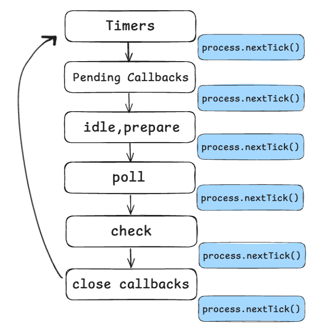
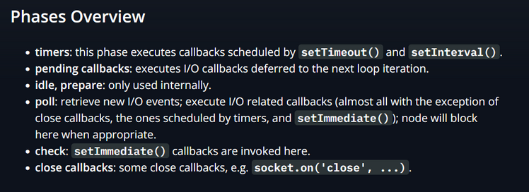
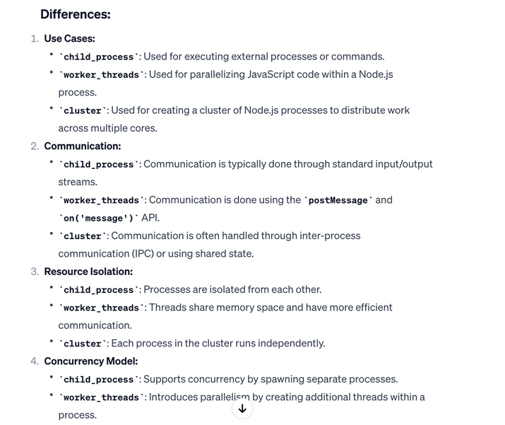
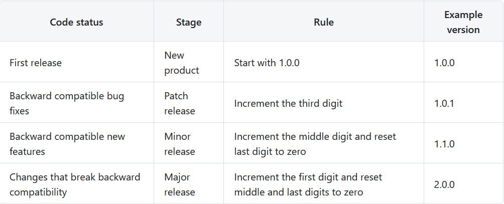

# NodeJs Interview Questions

1. ## **What is Node.js and how does it work?**

   Node.js is a server-side platform built on Chrome's JavaScript runtime for
   easily building fast and scalable network applications. It is an event-based,
   non-blocking, asynchronous I/O runtime that uses Google's V8 JavaScript
   engine and libuv library.

2. ## **Why is Node.js single-threaded?**

   Node.js was created explicitly as an experiment in async processing. This was
   to try a new theory of doing async processing on a single thread over the
   existing thread-based implementation of scaling via different frameworks

3. ## **Explain the steps how “Control Flow” controls the function calls?**

   Control the order of execution, Collect data, Limit concurrency, Call the
   following step in the program

4. ## **If Node.js is single threaded then how does it handle concurrency?**

   The main loop is single-threaded and all async calls are managed by Libuv
   library. Libuv sets up a thread pool to handle such concurrency

5. ## **What is an event-loop in Node JS?**

   Whatever that is, async is managed by event-loop using a queue and listener.
   So when an async function needs to be executed the main thread sends it to a
   different thread allowing V8 to keep executing the main code. Event loop
   involves different phases with specific tasks such as timers, pending
   callbacks, idle or prepare, poll, check, close callbacks with different FIFO
   queues. Also in between iterations it checks for async I/O or timers and
   shuts down cleanly if there aren't any

6. ## **What is REPL?**

   Read, Eval, Print, Loop which further means evaluating code on the go

7. ## **For Node.js, why does Google use a V8 engine?**

   Since it’s open-source, there's a huge community helping in developing
   features and fixing bugs and fastest we got till now as a javascript and Web
   Assembly engine. And it is portable to almost every machine known

8. ## **Explain what a Reactor Pattern is in Node.js?**

   Reactor pattern is a pattern for non-blocking I/O operations. But in general,
   this is used in any event-driven architecture.

   **Reactor**: Its job is to dispatch the I/O event to appropriate handlers

   **Handler**: Its job is to actually work on those events

9. ## **Describe the exit codes of Node.js?**

   Uncaught fatal exception, Unused, Fatal Error, Internal Exception etc..
   because of this errors our codes stops running

10. ## **How does Node.js overcome the problem of blocking of I/O operations?**

    Node has an event loop that can be used to handle all the I/O operations in
    an asynchronous manner without blocking the main function

11. ## **Node.js disadvantages?**

    **Single-Threaded Nature –** Since Node.js operates on a single-threaded
    event loop, it struggles with CPU-intensive tasks like complex calculations
    or video processing, which can block the event loop and slow down
    performance.  
    **Limited Multithreading Support** – While Node.js now supports worker
    threads, it is not as straightforward as using multiple threads in other
    languages like Java, making it less efficient for certain parallel computing
    tasks.  
    **Unstable API** – Frequent updates in Node.js sometimes introduce breaking
    changes, requiring developers to frequently update their codebases.  
    **Memory Consumption** – Compared to some other backend technologies,
    Node.js can consume more memory, which may be a concern in
    resource-constrained environments.  
    **Not Ideal for Heavy Computation** – Node.js is not the best choice for
    applications that require extensive mathematical computations or CPU-heavy
    tasks, as it can block the event loop.

12. ## **What are some commonly used timing features of Node.js?**

    setTimeout/clearTimeout: Used to implement delays in code execution
    setInterval/clearInterval: Used to run a code block multiple times
    setImmediate/clearImmediate: Takes a callback function and executes it in
    the next iteration of the event loop process.nextTick: Like setImmediate but
    its executes as soon as current operation ends

13. ## **Differentiate between process.nextTick() and setImmediate()?**

    process.nextTick() sets the callback to execute after current operation but
    setImmediate pushes the callback in the check phase queue
    

14. ## **What are node.js buffers?**

    Buffers is a data structure that provides a way to work with binary data
    directly and it’s temporarily data that is mainly used by stream, network,
    crypto, fs to hold on to some data until consumed

15. ## **What are node.js streams?**

    In Node.js, streams are a fundamental concept used to handle input and
    output operations. Streams provide an abstraction that allows you to read
    from or write to a continuous flow of data in chunks, rather than loading
    the entire data set into memory at once. This is especially useful when
    dealing with large amounts of data or when processing data in real-time.

    There are several types of streams in Node.js, and they can be categorized
    into four main types:

    **Readable Streams** \- Readable streams are used for reading data from a
    source. Examples include reading data from a file, receiving an HTTP
    request, or processing data from a database query. Readable streams emit a
    'data' event whenever there is data available to be read.

    ```ts
    const fs = require('fs')
    const readStream = fs.createReadStream('example.txt')

    readStream.on('data', chunk => {
      console.log('Received chunk:', chunk.toString())
    })

    readStream.on('end', () => {
      console.log('Stream ended')
    })
    ```

    **Writable Streams** \- Writable streams are used for writing data to a
    destination. Examples include writing data to a file, sending an HTTP
    response, or storing data in a database. Writable streams have a write
    method that allows you to write data to the stream.

    ```ts
    import fs from 'node:fs'

    const writeStream = fs.createWriteStream('output.txt')

    writeStream.write('Hello ')
    writeStream.write('world!')
    writeStream.end()
    ```

    **Duplex Streams** \- Duplex streams represent streams that are both
    readable and writable. An example of a Duplex stream is a TCP socket, where
    you can both send and receive data. Duplex streams provide a convenient way
    to model bidirectional communication.

    ```ts
    import net from 'node:net'

    const duplexStream = net.connect(3000, 'localhost')

    duplexStream.write('Hello server!')

    duplexStream.on('data', data => {
      console.log('Received data from server:', data.toString())
    })
    ```

    **Transform Streams** \- Transform streams are a special type of Duplex
    stream where the output is computed based on input.

    ```ts
    import fs from 'node:fs'
    import { Transform } from 'node:stream'

    const fileStream = fs.createReadStream('./file.txt')
    const transformedData = fs.createWriteStream('./transformedData.txt')

    const uppercase = new Transform({
      transform: (chunk, encoding, callback) => {
        callback(null, chunk.toString().toUpperCase())
      }
    })

    fileStream.pipe(uppercase).pipe(transformedData)
    ```

16. ## **What is piping?**

    Piping is a mechanism used to connect the output of one stream to another
    stream. It is normally used to retrieve data from one stream and pass output
    to another stream

17. ## **How many types of API functions are there in Node.js?**

    - **Asynchronous, non-blocking:** mostly I/O operations which can be fork
      out of the main loop
    - **Synchronous, blocking function:** mostly operations that influence the
      process running in the main loop

18. ## **Explain the concept of stub in Node.js?**

    Stubs are used in writing tests which are an important part of development.
    It replaces the whole function which is getting tested

19. ## **What does event-driven programming mean?**

    An event-driven programming approach uses events to trigger various
    functions. An event can be anything, such as typing a key or clicking a
    mouse button. A call-back function is already registered with the element
    executed whenever an event is triggered.

20. ## **What is an EventEmitter ?**

    In Node.js, an EventEmitter is a core module that provides an implementation
    of the observer pattern. The observer pattern is a behavioral design pattern
    where an object, known as the subject, maintains a list of dependents, known
    as observers, that are notified of any state changes, typically by calling
    one of their methods.  
    The EventEmitter class in Node.js allows objects to emit named events that
    cause registered listeners (observers) to be called. It provides a mechanism
    for communication between different parts of a Node.js application, making
    it an essential tool for building scalable and modular systems.

    ```ts
    const EventEmitter = require('events')

    class MyEmitter extends EventEmitter {}

    const myEmitter = new MyEmitter()

    // Listener 1
    myEmitter.on('event', (a, b) => {
      console.log('Listener 1:', a, b)
    })

    // Listener 2
    myEmitter.on('event', (a, b) => {
      console.log('Listener 2:', a, b)
    })

    // Emitting the event
    myEmitter.emit('event', 'Hello', 'World')
    ```

21. ## **What is WASI and why is it being introduced?**

    Browsers understand either javascript or Web Assembly so nodejs is builtin
    on top of javascript thats why it’s very rare to use WASI (Web Assembly
    Server Interface) API in nodejs

22. ## **What is the Process object?**

    In Node.js, the process object is a global object that provides information
    about, and control over, the current Node.js process. It allows you to
    interact with the environment in which the process is running, access
    command-line arguments, handle signals, and more.

    Here are some common uses and properties of the process object:

    - **Accessing Command-Line Arguments** \- The process.argv property is an
      array that contains the command-line arguments used to run the Node.js
      process. The first two elements are the path to the Node.js executable and
      the path to the script being run.  
      console.log(process.argv);
    - **Environment Variables \-** The process.env property is an object
      containing the user environment. You can use it to access environment
      variables.

      ```ts
      console.log(process.env.HOME)
      ```

    - **Standard Input/Output Streams** \- The process.stdin, process.stdout,
      and process.stderr streams represent the standard input, output, and error
      streams, respectively.

      ```ts
      process.stdout.write('Hello, stdout!\n')
      ```

    - **Exit the Process** \- The process.exit() method allows you to exit the
      Node.js process with a specified exit code. By convention, a code of 0
      indicates success, and any other value indicates an error.  
      process.exit(0); // Exit with success
    - **Event Handling** \- The process object is an event emitter. You can use
      process.on() to listen for various events, such as 'exit',
      'unhandledRejection', and others.
      ```ts
      process.on('exit', code => {
        console.log('Process exited with code: ${code)')
      })
      ```
    - **Working Directory** \- The process.cwd() method returns the current
      working directory of the Node.js process.  
      console.log(process.cwd());
    - **Memory Usage** \- The process.memoryUsage() method returns an object
      describing the memory usage of the Node.js process.
    - **PID (Process ID) \-** The process.pid property contains the process ID
      of the Node.js process.  
      These are just a few examples of what the process object can be used for.
      It provides a way to interact with the runtime environment, handle events,
      and control the behavior of the Node.js process.

23. ## **What are global objects?**

    Global objects in Node.js are objects that are available in all modules
    without the need for an explicit require statement. Some of the most
    commonly used global objects in Node.js include process, console, and
    buffer.

24. ## **What is the purpose of module.exports?**

    To use our file, module, function etc.. in the other file we can import them

25. ## **What are modules in nodejs?**

    In Node.js, Modules are the blocks of encapsulated code that communicate
    with an external application on the basis of their related functionality.
    Modules can be a single file or a collection of multiple files/folders. The
    reason programmers are heavily reliant on modules is because of their
    reusability as well as the ability to break down a complex piece of code
    into manageable chunks.

    **Modules are of three types:**

    - Core Modules
    - Local Modules
    - Third-party Modules

26. ## **What is the job of the fs module?**

    The fs module in Node.js provides an API for interacting with the file
    system. It allows you to perform various operations on the file system, such
    as reading from and writing to files, creating and deleting directories, and
    more.

27. ## **What is the use of the crypto module in Node.js?**

    The crypto module is a built-in module that provides cryptographic
    functionality. It allows developers to perform various cryptographic
    operations, such as hashing, encrypting and decrypting data, generating
    random bytes, and working with digital signatures.

28. **Node.js queue phases**  
      
    here it’s more explained \=\>
    [link](https://www.deepintodev.com/blog/how-nodejs-works-behind-the-scenes)

29. ## **What is Libuv?**

    [https://www.geeksforgeeks.org/libuv-in-node-js/](https://www.geeksforgeeks.org/libuv-in-node-js/)

30. ## **What is a thread pool and which library handles it in Node.js**

    The Thread pool is handled by the libuv library. libuv is a multi-platform C
    library that provides support for asynchronous I/O-based operations such as
    file systems, networking, and concurrency.

31. ## **Thread pool?**

    The **Thread Pool** is a set of worker threads (managed by **libuv**) that
    handle **offloaded I/O and CPU-intensive tasks** to prevent blocking the
    main event loop.  
    It has 4 threads default and purpose is to execute blocking operations like
    file I/O, DNS, crypto, etc.. asynchronously.  
    Why we need it is because JS is single-threaded, but some tasks like file
    I/O are inherently blocking. That’s why it offloads these tasks to worker
    threads to keep the event loop free.

32. ## **Enhancing Node.js performance through clustering.**

    Node.js applications run on a single processor. Cluster mode is used to
    start up multiple node.js processes thereby having multiple instances of the
    event loop. When we start using cluster in a nodejs app behind the scene
    multiple node.js processes are created but there is also a parent process
    called the **cluster manager** which is responsible for monitoring the
    health of the individual instances of our application

33. ## **How are worker threads different from clusters?**

    Through both Worker thread and Clusters are mechanisms for concurrent and
    parallel processing, but still they have different use cases and operate at
    different levels of abstraction that differentiates both Worker threads and
    Clusters, which is given below.

    - Granularity: Worker thread are thread level, Clusters are process level
    - Communication: Worker thread communicates using postMessage API, Clusters
      using IPC
    - Isolation: Workers don’t share variables or memory directly, Clusters have
      their own memory space
    - I/O Operations: Worker threads are not built for I/O operations, Clusters
      are built for handle I/O operations efficiently
    - Memory Sharing: Worker thread can share memory using ArrayBuffer or
      SharedArrayBuffer instances, which allows more direct communication and
      shared data. Clusters operate in separate processes so memory is isolated
      between them. Communication between clusters is often achieved through
      message passing
    - Use Case: Worker Threads are good for CPU tasks where parallel processing
      can significantly improve performance. Clusters are good for improving the
      scalability of networked applications by distribution incoming requests
      among multiple processes

34. ## **Difference between child_process, worker_threads, and cluster?**

    

35. ## **What is fork in node JS?**

    In general, it’s used to spawn child processes. It creates new instance of
    v8 engine to run multiple workers to execute the code

36. ## **How do you manage packages in your node.js project and tell me more about versioning?**

    It can be managed by npm, pnpm, yarn. And to maintain version we use
    package.json and package-lock.json.

    Here's the explanation of versioning:

    

    **~version:** “Approximately equivalent to version”, will automatically
    update you to all future patch versions that are backwards-compatible,
    without incrementing the minor version. ~1.2.3 will use releases from 1.2.3
    to < 1.3.0.

    **^version:** “Compatible with version”, will automatically update you to
    all future minor/patch versions that are backwards-compatible, without
    incrementing the major version. ^1.2.3 will use releases from 1.2.3 to <
    2.0.0.
