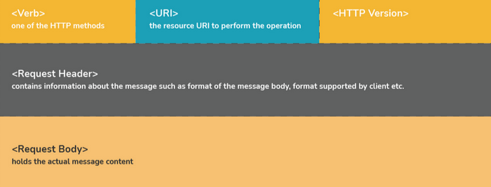
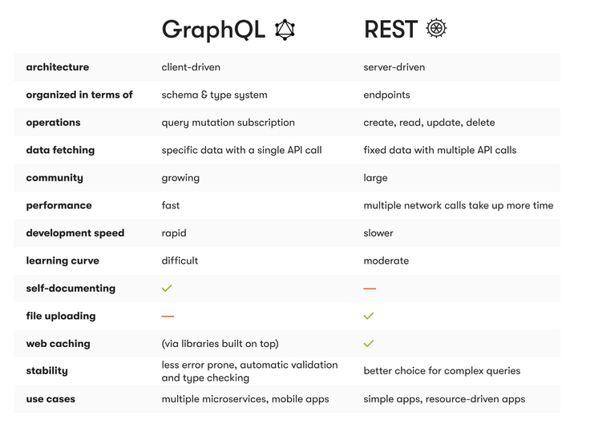

#           REST API Interview Questions

1. ## **REST API?**  
    *A REST API (Representational State Transfer API) is a web service that follows REST architectural principles for client-server communication over HTTP. It's stateless (each request is independent) and typically uses JSON*  

    ### Key Features:  
    - **Stateless**: No client session data stored on server.  
    - **HTTP Methods**: Uses GET, POST, PUT, PATCH, DELETE.  
    - **Resource-Oriented**: Data accessed via unique URLs.  
    - **Lightweight**: Optimized for performance/caching.  

2. ## **What is API?**  
   *An **API (Application Programming Interface)** is a set of rules and protocols that allows different software applications to communicate with each other. It defines how requests and responses should be structured, enabling seamless data exchange*  

3. ## **How would you implement caching for a REST API?**  
   *Cache API responses for commonly requested data, using HTTP headers like Cache-Control or implement server-side caching (e.g., **Redis** or **Memcached**)*

4. ## **Define Messaging in terms of RESTful web services.**
    *Sending a request from client side with HTTP and taking response from server is called messaging and messages contained constitute the data and the metadata about the message*

5. ## **Can you tell the disadvantages of RESTful web services?**
    *It’s not possible to maintain sessions. REST doesn’t impose security restrictions inherently*

6. ## **HTTP Methods**  
    Standard actions for interacting with resources via **HTTP**:  

    - **GET** - Fetch data (read-only)  
    - **POST** - Create new data  
    - **PUT** - Update existing data (full replacement)  
    - **DELETE** - Remove data  
    - **PATCH** - Partial update (or create)  
    - **OPTIONS** - List supported operations  

    *Note: PUT vs PATCH - PUT replaces entire resource, PATCH modifies partially*

7. ## **HTTP Status Codes**  
    Quick reference for HTTP response status codes:

    - **1xx (Informational)**: Request received, continuing process
    - **2xx (Success)**: Request successfully processed
        - `200 OK` - Standard success response
        - `201 Created` - Resource created
        - `204 No Content` - Success with no body
    - **3xx (Redirection)**: Further action needed
        - `301 Moved Permanently`
        - `302 Found` (Temporary redirect)
    - **4xx (Client Error)**: Invalid request
        - `400 Bad Request`
        - `401 Unauthorized`
        - `403 Forbidden`
        - `404 Not Found`
    - **5xx (Server Error)**: Server failed
        - `500 Internal Server Error`
        - `502 Bad Gateway`
        - `503 Service Unavailable`

8. ## **What is the concept of statelessness in REST?**
    *The REST architecture is designed in such a way that the client state is not maintained on the server. This is known as statelessness*

9. ## **What are the features of RESTful Web Services?**
    The service is based on the Client Server model    The service uses HTTP Protocol for fetching data/resources, query execution, or any other functions.    The medium of communication between the client and server is called “Messaging”    Resources are accessible to the service by means of URIs    These services can also use SOAP services as implementation protocol to REST architectural pattern

10. ## **What is URI/URL/URN?**
    * **URI:** \<protocol\>://\<service-name\>/\<ResourceType\>/\<ResourceID\>
    * **URL:** `http://abc.com/samplePage.html`
    * **URN:** `urn:mpeg:mpeg7:schema:2001`

11. ## **Can you tell what constitutes the core components of HTTP Request?**
    The 5 essential parts of an HTTP request in REST:

    1. **Method/Verb**  
        - Specifies the action type (GET, POST, PUT, etc.)
    
    2. **URI (Uniform Resource Identifier)**  
        - Identifies the target resource on the server  
        - Example: `/api/users/123`

    3. **HTTP Version**  
        - Specifies protocol version (e.g., `HTTP/1.1` or `HTTP/2`)

    4. **Request Header**  
        - Contains metadata about the request:
            - `Content-Type` (format of body data)
            - `Accept` (response formats client can handle)
            - `Authorization` (credentials)
            - `Cache-Control` (caching directives)

    5. **Request Body** (optional)  
        - Contains the actual data being sent  
        - Used with POST, PUT, PATCH methods  
        - Common formats: JSON, XML, form-data

     

    

12. ## **What constitutes the core components of HTTP Response?**
    The 4 essential parts of an HTTP response:

    1. **HTTP Version**  
        - Indicates protocol version (e.g., `HTTP/1.1` or `HTTP/2`)

    2. **Response Status Code**  
        - 3-digit code indicating request outcome:
            - `1xx`: Informational
            - `2xx`: Success (e.g., `200 OK`)
            - `3xx`: Redirection
            - `4xx`: Client errors (e.g., `404 Not Found`)
            - `5xx`: Server errors (e.g., `500 Internal Server Error`)

    3. **Response Headers**  
        - Metadata about the response:
            - `Content-Type`: Format of response body (e.g., `application/json`)
            - `Content-Length`: Size of response body
            - `Cache-Control`: Caching directives
            - `Set-Cookie`: Server cookies

    4. **Response Body** (optional)  
        - Contains the actual response data  
        - Common formats: JSON, XML, HTML, plain text

13. ## **Define Addressing in terms of RESTful Web Services.**  
    *Addressing is the process of location a single/multiple resources that are present on the server*  

14. ## **GraphQL vs REST API?**  
    ### **GraphQL**
    ✅ **Flexible Data Querying**  
    - Clients specify exact data requirements  
    - Eliminates over-fetching/under-fetching  
    - Better for complex queries  

    ✅ **Efficient Data Loading**  
    - Fetch multiple resources in single query  
    - Reduces network overhead  

    ✅ **Versioning**  
    - Schema-based approach simplifies versioning  
    - Changes don't break existing clients  

    ✅ **Self-Documenting**  
    - Built-in schema exploration  
    - Clients can discover API capabilities  

    ### **REST API**
    ✅ **Simplicity**  
    - Easy to understand and implement  
    - Well-established standard  
    - Large developer community  

    ✅ **Caching**  
    - Designed to be cacheable  
    - Straightforward caching strategies  

    ✅ **Familiarity**  
    - Low learning curve  
    - Widely adopted and understood  

    ### **When to Use Which?**
    | **GraphQL** | **REST** |
    |-------------|----------|
    | Complex data requirements | Simple CRUD operations |
    | Multiple data sources | Established caching needs |
    | Rapidly evolving APIs | Public-facing APIs |
    | Mobile clients needing efficiency | Projects needing simplicity |

 

  
