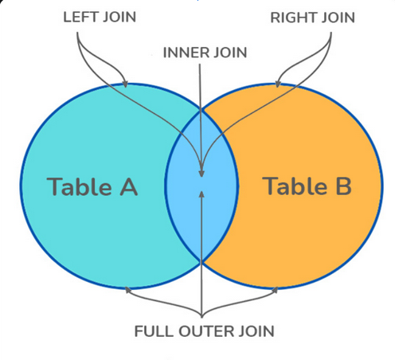
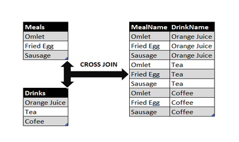

# SQL Interview Questions

## Database Fundamentals

1. ### **What is Database**

   _An organized collection of data stored and retrieved digitally from
   remote/local systems_

2. ### **What is RDBMS? How is it different from DBMS**
   - **DBMS:** _Software to define, create and maintain databases_
   - **RDBMS:** _Advanced version with relational capabilities (tables,
     relations)_

3. ### **Difference between SQL and MySQL**
   - **SQL:** _Language for RDBMS_
   - **MySQL:** _Specific RDBMS product using SQL_

4. ### **Tables and Fields**
   - **Tables:** _Collections of columns (fields) and rows (records)_
   - **Fields:** _Columns defining data attributes_

## SQL Commands & Operations

5. ### **SQL Command Categories**
   - DDL (CREATE, ALTER, DROP, TRUNCATE) \- _to work with tables_
   - DML (INSERT, UPDATE, DELETE) \- _to work with data actions_
   - DQL (SELECT) \- _to retrieve data_
   - TCL (COMMIT, ROLLBACK) \- _to work with transactions_
   - DCL (GRANT, REVOKE) \- _to grant/revoke permission_

6. ### **SELECT Statement Fundamentals**
   - Retrieves data from tables
   - Common clauses:
     - **WHERE** _(filtering)_
     - **ORDER BY** _(sorting_)
     - **GROUP BY** _(aggregation)_
     - **HAVING** _(filter groups)_

7. ### **Pattern Matching**
   _Uses **LIKE/ILIKE** with wildcards:_
   - **%** (any sequence)
   - **\_** (single character)  
     **Example:** `sql WHERE name LIKE 'J%' `

## Database Objects

8. ### **Creating Table Copies**

   ```sql
   CREATE TABLE new_table AS SELECT * FROM original_table WHERE 1=0;
   ```

9. ### **Views**

   _Saved SQL queries acting as virtual tables_

10. ### **Indexes in PostgreSQL**
    - **B-Tree:** _Default ordered index_
    - **Hash:** _Fast equality checks_
    - **Composite:** _Multiple columns_
    - **Partial:** _Conditional indexing_
    - **BRIN:** _For large sorted datasets_

## Constraints & Keys

11. ### **Primary Key**

    _Uniquely identifies rows (UNIQUE + NOT NULL)_

12. ### **Foreign Key**

    _References primary key in another table_

13. ### **UNIQUE Constraint**

    _Ensures column values are distinct_

14. ### **Common Constraints**
    ```sql
    NOT NULL, CHECK, DEFAULT, UNIQUE, PRIMARY KEY, FOREIGN KEY
    ```

## Joins & Relationships

15. ### **Join Types**

    
    - **INNER:** _Matching rows only_
    - **LEFT/RIGHT:** _All rows from one side_
    - **FULL:** _All rows from both_
    - **CROSS:** _Cartesian product_ 
    - **SELF:** _Join table to itself_

16. ### **Table Relationships**
    - One-to-One
    - One-to-Many
    - Many-to-Many
    - Self-Referencing

## Advanced Queries

17. ### **Subqueries**

    Nested queries used in:
    - **WHERE** clauses
    - **FROM** clauses
    - **SELECT** expressions

18. ### **Set Operations**
    - **UNION:** _Combine results_
    - **INTERSECT:** _Common rows_
    - **MINUS/EXCEPT:** _Row differences_

## Data Modification

19. ### **Data Modification Commands**
    - **INSERT:** _Add new rows_
    - **UPDATE:** _Modify existing rows_
    - **DELETE:** _Remove rows_
    - **TRUNCATE:** _Empty table_
    - **DROP:** _Remove table_

20. ### **Column Modification**
    ```sql
    ALTER TABLE table_name
    ALTER COLUMN column_name TYPE new_data_type;
    ```

## PostgreSQL Specifics

21. ### **Database Management**
    - **CREATE DATABASE:** _New database_
    - **\l:** _List all databases_

22. ### **ACID Compliance**

    PostgreSQL fully supports:
    - **Atomicity**
    - **Consistency**
    - **Isolation**
    - **Durability**

23. ### **Commit vs Checkpoint**
    - **Commit:** _Finalizes transaction_
    - **Checkpoint:** _Writes changes to disk_

## Database Design

24. ### **Data Normalization**

    Process to:
    - Reduce redundancy
    - Improve integrity  
      Through normal forms (1NF, 2NF, 3NF etc.)

25. ### **Aliases**
    _Temporary names for columns/tables:_
    ```sql
    SELECT col AS alias FROM table t;
    ```

## Functions

26. ### **Aggregate Functions**

    _Operate on value sets:_

    ```sql
    COUNT(), SUM(), AVG(), MAX(), MIN()
    ```

27. ### **Scalar Functions**
    _Single-value operations:_
    ```sql
    UPPER(), LOWER(), ROUND(), NOW()
    ```
