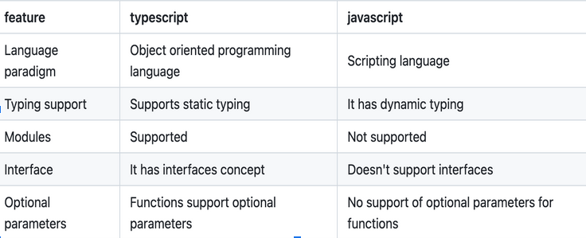

# TypeScript Interview Questions

## Fundamentals

1. ### **What is TypeScript**

   _TypeScript is a superset of JavaScript that adds static typing to the
   language. It is an open-source programming language developed and maintained
   by Microsoft. TypeScript is designed for large-scale JavaScript application
   development, providing developers with tools to write more reliable and
   maintainable code_

2. ### **What are the differences between JavaScript and TypeScript**

   

3. ### **What are the advantages of TypeScript over JavaScript**
   _Below are some of the advantages of typescript over javascript_
   - TypeScript is able to find compile time errors at the development time only
   - TypeScript is strongly-typed or supports static typing
   - TypeScript compilers can compile the .ts files into ES3,ES4 and ES5

## Basic Types

4. ### **What are the primitive types in TypeScript**

   - **Built-in types:**
     - String
     - Number
     - Boolean
     - Null
     - Undefined
     - Any
     - Void
     - Symbol
   - **User-defined types:**
     - Arrays
     - Enums
     - Classes
     - Interfaces

5. ### **What is the difference between never, unknown, and any**

   - **never:**

     - Represents values that never occur
     - Used for functions that always throw or never return
       ```ts
       function throwError(
         message: string = 'What the hell is going on?'
       ): never {
         throw new Error(message)
       }
       ```

   - **unknown:**

     - Represents values we know nothing about
     - Requires type checking before use

       ```ts
       let userInput: unknown

       // Type assertion
       let userName: string = userInput as string

       // Type checking
       if (typeof userInput === 'string') {
         userName = userInput
       }
       ```

   - **any:**

     - Opts out of type checking
     - Used for dynamic content or migration

       ```ts
       let myValue: any = 42

       // No type checking is performed
       let result: string = myValue // No error at compile-time
       ```

## Variables & Functions

6. ### **Provide the syntax of a function with the type annotations**

   _Functions are blocks of code to perform a specific code. Functions can
   optionally take one or more arguments, process them, and optionally return a
   value_

   ```ts
   // primitives
   let userName: string = 'Alice'
   let userAge: number = 30
   let isActive: boolean = true

   // arrays
   let numbers: number[] = [1, 2, 3, 4, 5] // Array of numbers
   let names: string[] = ['John', 'Jane', 'Peter'] // Array of strings

   // objects
   let person: { name: string; age: number; city?: string } = {
     name: 'Bob',
     age: 25
   }

   // etc...
   ```

7. ### **Provide the TypeScript syntax to create function overloads**

   _It allows us to create multiple functions with the same name but different
   arguments. Typescript itself defines by argument_

   ```ts
   // Overload signatures
   function combine(a: number, b: number): number
   function combine(a: string, b: string): string

   // Implementation signature (must be compatible with all overloads)
   function combine(a: any, b: any): any {
     if (typeof a === 'number' && typeof b === 'number') {
       return a + b // Performs addition for numbers
     } else if (typeof a === 'string' && typeof b === 'string') {
       return a + b // Performs concatenation for strings
     }
     throw new Error(
       "Invalid arguments: 'combine' expects either two numbers or two strings."
     )
   }

   // Usage examples
   console.log(combine(5, 10)) // Output: 15 (number)
   console.log(combine('Hello, ', 'World!')) // Output: "Hello, World!" (string)

   // This would result in a TypeScript error:
   // combine(5, "World!"); // Argument of type 'string' is not assignable to parameter of type 'number'.
   ```

8. ### **Can you overload a function with generics**

   _Yes, but implementation must be compatible with all overloads._

   ```ts
   function parse<T extends string | number>(input: T): T
   function parse(input: any): any {
     return input
   }
   ```

## Objects & Interfaces

9. ### **What is an interface in TypeScript, and how is it different from a class**

   _In TypeScript, an interface serves as a blueprint for defining how an object
   should look. It outlines the properties an object should have and their
   respective types but doesn't include any actual code_

   ```ts
   interface Person {
     name: string
     age: number
   }

   const me: Person = {
     name: 'Me',
     age: 1
   }

   // the Person interface helps us define what properties a me object should have – in this case, a name of type string and an age of type number
   ```

10. ### **What is the difference between type and interface**

    _Both type and interface are used to define custom types, but there are
    subtle differences in their capabilities and use cases_

    - **Declaration Syntax:**

      - **Interface:** _Interfaces are typically used to define object shapes.
        They can describe the structure of objects, including properties,
        methods, and index signatures_

      ```ts
      interface Person {
        name: string
        age: number
      }
      ```

      - **Type:** _The type keyword is more versatile. It can be used to define
        object types, union types, intersection types, and more_

      ```ts
      type Person = {
        name: string
        age: number
      }
      ```

    - **Extending and Implementing:**

      - **Interface:** _Interfaces can extend other interfaces using the extends
        keyword. They are also used for class implementation_

      ```ts
      interface Animal {
        legs: number
      }

      interface Dog {
        breed: string
      }
      ```

      - **Type:** _The type keyword can be used for creating union types,
        intersection types, and mapped types. However, it cannot be extended or
        implemented like interfaces_

      ```ts
      type Animal = {
        legs: number
      }
      type Dog = Animal & {
        breed: string
      }
      ```

    - **Declaration Merging:**

      - **Interface:** _Interfaces support declaration merging, which allows
        multiple interface declarations with the same name to be merged into a
        single declaration_

      ```ts
      interface Car {
        model: string
      }
      interface Car {
        brand: string
      }
      // Merged interface
      // {model: string, brand: string}
      ```

      - **Type:** _The type keyword does not support declaration merging. If you
        try to declare two types with the same name, it will result in an error_

      ```ts
      type Car = {
        model: string
      }

      // Error: Duplicate identifier
      type Car = {
        brand: string
      }
      ```

    - **Immutability:**

      - **Interface:** _Interfaces are open to extension, meaning you can add
        new properties when extending an interface_

      ```ts
      interface Person {
        name: string
        age: number
      }

      // Extending the interface
      interface PersonWithAddress extends Person {
        address: string
      }
      ```

      - **Type:** _The type keyword supports mapped types, allowing the creation
        of new types based on existing ones. However, it is generally considered
        more closed to modification_

      ```ts
      type Person = {
        name: string
        age: number
      }

      // Creating a new type based on an existing type
      type PersonWithAddress = Person & {
        address: string
      }
      ```

    - **Choosing Between type and interface:**
      - **Interface:**
        - _Defining object shapes, especially for objects that represent
          instances of a class_
        - _Extending other interfaces or implementing classes_
      - **Type:**
        - _Defining union types, intersection types, or creating complex types
          that involve mapped types_
        - _Expressing types that cannot be represented using interfaces_
      - _In practice, the choice between type and interface often comes down to
        personal or team preferences. Some developers prefer the clarity and
        convention of using interfaces for object shapes, while others
        appreciate the flexibility and versatility provided by the type keyword.
        Both type and interface are powerful tools in TypeScript, and you can
        choose the one that best fits your use case_

11. ### **Declaration merging**

- Declaration merging is a feature in TypeScript that allows you to combine
  multiple declarations of the same name into a single definition. This is
  particularly useful with interface (but not with type)\*

## Classes & OOP

11. ### **What are abstract classes? When should you use one**

    _Abstract classes are similar to interfaces in that they specify a contract
    for the objects, and you cannot instantiate them directly_

12. ### **How to make object properties immutable in TypeScript**

    _By using **readonly** keyword before the property name_

13. ### **What are the **'implements'** clauses in TypeScript**

    _It's used to check that a class satisfies the contract specified by an
    interface_

14. ### **Explain the concept of inheritance in TypeScript**
    _It allows us to extend from another class and reuse or modify the behavior_

## Advanced Types

15. ### **What are Union and Intersection Types**

    - **Union Type:** _In TypeScript, union types, marked by **|**, allow a
      variable to have values from different types_

    ```ts
    type Cat = { name: string, meow: () => void };
    type Dog = { name: string, bark: () => void };

    const pet: Cat | Dog = // Either Cat or Dog
    ```

    - **Intersection Type:** _Intersection types, shown by **&**, bring together
      multiple types to form a new type with all the properties of each
      individual type_

    ```ts
    type Name = string
    type Age = number

    type Person = Name & Age

    const me: Person = { name: 'me', age: 1 }
    ```

16. ### **What are type aliases? How do you create one**

    _If we've variable either string or number. We can create type something
    **string | number** and use this type to that variable_

17. ### **What are string literal types**

    _You can refer to specific string or numbers as types_

    ```ts
    let status: 'active'
    status = 'active' // Valid
    status = 'inactive' // Error: Type '"inactive"' is not assignable to type '"active"'.
    ```

18. ### **What are template literal types**

    _They're like string literal but you can combine them with concrete_

    ```ts
    type Size = 'small' | 'medium' | 'large'
    type SizeMessage = `The selected size is ${Size}.`

    let message1: SizeMessage = 'The selected size is small.' // Valid
    let message2: SizeMessage = 'The selected size is extra-large.' // Error: Type '"The selected size is extra-large."' is not assignable to type '"The selected size is small." | "The selected size is medium." | "The selected size is large."'.
    ```

19. ### **What are Conditional Types**

    _Conditional types in TypeScript help us describe different type mappings
    based on certain conditions_

    ```ts
    type IsString<T> = T extends string ? true : false

    type A = IsString<'hello'> // type A = true
    type B = IsString<123> // type B = false
    ```

20. ### **What are mapped types, and how do they work**

    _Mapped types in TypeScript allow you to create new types by changing the
    properties of existing ones_

    ```ts
    type OriginalType = {
      propA: string
      propB: number
    }

    // Example of a mapped type making all properties optional
    type OptionalType<T> = {
      [K in keyof T]?: T[K]
    }

    type MyOptionalType = OptionalType<OriginalType>
    // MyOptionalType will be: { propA?: string; propB?: number; }
    ```

21. ### **List some of the utility types provided by TypeScript and explain their usage**
    _Partial, Required, Readonly, Record, Promise, Awaited, Pick, Omit_

## Special Types

22. ### **What is void, and when to use the void type**

    _Let's say you've a function which returns nothing, that means it's void
    function_

## Arrays & Tuples

23. ### **Explain how the arrays work in TypeScript**

    _We use arrays to store values of the same type. Arrays are ordered and
    indexed collections of values_

24. ### **Explain how tuple destructuring works in TypeScript**

    _Instead of giving one type to array elements we can separate them one by
    one, this is why we need tuples. And it's works pretty easy like
    destructuring_

    ```ts
    // Define a tuple type
    type UserInfo = [number, string, boolean]

    // Create a tuple instance
    const user: UserInfo = [101, 'Alice', true]

    // Destructure the tuple into individual variables
    const [id, name, isActive] = user

    console.log(id) // Output: 101
    console.log(name) // Output: Alice
    console.log(isActive) // Output: true
    ```

25. ### **What are variadic tuple types**

    _They allow defining tuples with rest elements._

    ```ts
    type Tail<T extends any[]> = T extends [any, ...infer Rest] ? Rest : never
    type T = Tail<[1, 2, 3]> // [2, 3]
    ```

## Enums

26. ### **What is enums**

    _In TypeScript, enums work similarly to enums in other programming
    languages, providing a way to define a set of named constants_

    ```ts
    // Numeric Enum
    enum DaysOfWeek {
      Sunday,
      Monday,
      Tuesday,
      Wednesday,
      Thursday,
      Friday,
      Saturday
    }

    let today: DaysOfWeek = DaysOfWeek.Monday // 1
    // ------
    // String Enum
    enum DaysOfWeek {
      Sunday = 'Sunday',
      Monday = 'Monday',
      Tuesday = 'Tuesday',
      Wednesday = 'Wednesday',
      Thursday = 'Thursday',
      Friday = 'Friday',
      Saturday = 'Saturday'
    }
    let today: DaysOfWeek = DaysOfWeek.Monday // Monday
    ```

27. ### **What are const enums**

    _They are similar to enums, but declared with const. When compiled, only the
    values of the enum members are emitted as constants. This is why you can use
    const enums in your JavaScript code without having to wrap them in a
    function_

## Modern Features

28. ### **What is optional chaining**

    _Instead of checking all the way down we can just use a ?. And it returns
    undefined it's not exist_

    ```ts
    interface User {
      name: string
      address?: {
        street: string
        city?: string // city is optional
      }
    }

    const user1: User = { name: 'Alice', address: { street: 'Main St' } }
    const user2: User = { name: 'Bob' } // No address property

    // Accessing a potentially nested property safely
    const city1 = user1.address?.city // "undefined" (because city is optional and not provided)
    const city2 = user2.address?.city // "undefined" (because address is missing)

    // Calling a method safely
    interface Service {
      doSomething?(): void
    }

    const service1: Service = {
      doSomething: () => console.log('Doing something')
    }
    const service2: Service = {}

    service1.doSomething?.() // Calls the method
    service2.doSomething?.() // Does nothing, no error
    ```

29. ### **What is the 'in' operator**

    _It's used to find if a property is in the specified object_

    ```ts
    const car = { make: 'Toyota', model: 'Corolla' }
    console.log('make' in car) // true
    console.log('year' in car) // false
    ```

30. ### **What are TypeScript decorators, and how do they work**

    _TypeScript decorators are special functions used to modify or add behavior
    to classes, methods, properties, or parameters at runtime_

    ```ts
    function first() {
      console.log('first(): factory evaluated')
      return function (
        target: any,
        propertyKey: string,
        descriptor: PropertyDescriptor
      ) {
        console.log('first(): called')
      }
    }

    function second() {
      console.log('second(): factory evaluated')
      return function (
        target: any,
        propertyKey: string,
        descriptor: PropertyDescriptor
      ) {
        console.log('second(): called')
      }
    }

    class ExampleClass {
      @first()
      @second()
      method() {}
    }

    // output:
    // first(): factory evaluated
    // second(): factory evaluated
    // second(): called
    // first(): called
    ```

## Configuration

31. ### **What is the purpose of the tsconfig.json file**

    _It provides the compiler options to compile the project_

32. ### **How to enforce strict null checks in TypeScript**
    _It's a way to check all possibilities that can be null. And to enforce it
    we change tsconfig.json file strictNullChecks to true_

## Type System

33. ### **What is meant by type inference**

    _When you don't provide an explicit type typescript itself defines type_

    ```ts
    let x = 10 // TypeScript infers 'x' as 'number'
    let message = 'Hello' // TypeScript infers 'message' as 'string'
    ```

34. ### **What is meant by contextual typing**

    _When the typescript compiler uses the location of a variable to infer its
    type, it's called contextual typing_

    ```ts
    window.onmousedown = function (mouseEvent) {
      console.log(mouseEvent.button) // No error, TypeScript infers mouseEvent as MouseEvent
      console.log(mouseEvent.kangaroo) // Error: Property 'kangaroo' does not exist on type 'MouseEvent'
    }
    ```

35. ### **When would you use type assertion**

    _Type assertion in TypeScript is a mechanism to tell the compiler that you
    know more about the type of a value than TypeScript can infer_

    ```ts
    // as keyword
    let someValue: any = 'this is a string'
    let strLength: number = (someValue as string).length

    // <> syntax
    let someValue: any = 'this is a string'
    let strLength: number = (<string>someValue).length
    ```

## Advanced Concepts

36. ### **Does TypeScript support static classes? If not, why**

    _In Typescript you can create any data and functions as simple objects
    without creating a containing class. Hence typescript doesn't need static
    classes_

37. ### **What is the Function type in TypeScript**

    _Function is a global type in typescript and it has properties like bind,
    call and apply with other properties_

38. ### **What is a type declaration file**

    _It's a file which ends with .d.ts extension providing a way to declare the
    existence of some types or values without actually providing implementations
    for those values_

39. ### **Explain the various ways to control member visibility in TypeScript**

    - **public:** _You can access a public member anywhere outside the class_
    - **protected:** _It's visible only to the subclasses_
    - **private:** _It's only visible inside the class_

40. ### **What are Type Guards**

    - **typeof:** _check primitive types_
    - **keyof:** _check is key available in object_
    - **instanceof:** _check class instances_
    - **in:** _check if a property exist in an object_
    - **is:** _User Defined Type Guard_

41. ### **Difference between keyof, typeof, and their combined usage**

    - **keyof:** _Used to get the keys of an object_
    - **typeof:** _Used to get the type of a variable_
    - **keyof and typeof:** _Combined usage to get the type of an object key_

    ```ts
    const person = {
      name: 'John',
      age: 30
    }

    type PersonKeys = keyof typeof person // 'name' | 'age'
    ```

42. ### **Explain how TypeScript infers types**

    _TypeScript uses type inference to automatically determine the types of
    variables based on their assigned values while declaring_

43. ### **What are generics in TypeScript, and when would you use them**

    _Generics in TypeScript provide a way to create reusable components and
    functions while maintaining flexibility in the types they work with_

    ```ts
    // functions
    function identity<T>(arg: T): T {
      return arg
    }
    let output = identity<string>('hello') // T is inferred as string

    // interfaces
    interface Box<T> {
      value: T
    }
    let stringBox: Box<string> = { value: 'text' }

    // classes
    class GenericContainer<T> {
      private data: T
      constructor(data: T) {
        this.data = data
      }
      getData(): T {
        return this.data
      }
    }
    let numberContainer = new GenericContainer<number>(123)

    // constraints
    interface Lengthwise {
      length: number
    }
    function loggingIdentity<T extends Lengthwise>(arg: T): T {
      console.log(arg.length) // Now 'arg' is guaranteed to have a 'length' property
      return arg
    }
    ```

44. ### **What is the declare keyword**

    _The declare keyword in TypeScript is used to inform the compiler that a
    variable, method, or library is defined externally_

    ```ts
    declare const jQuery: (selector: string) => any
    declare function myFunction(arg: number): string
    declare class MyGlobalClass {
      constructor(name: string)
      method(): void
    }
    ```

45. ### **What is a discriminated union and how does it help in type safety**

    _Discriminated unions use a common literal property (tag) to distinguish
    between different variants._

    ```ts
    type Circle = { kind: 'circle'; radius: number }
    type Square = { kind: 'square'; side: number }
    type Shape = Circle | Square

    function getArea(shape: Shape) {
      switch (shape.kind) {
        case 'circle':
          return Math.PI * shape.radius ** 2
        case 'square':
          return shape.side * shape.side
      }
    }
    ```

46. ### **What is as const and how is it used**

    _The as const keyword in TypeScript is used to create a constant variable
    whose type cannot be changed_

    ```ts
    const settings = {
      mode: 'dark',
      layout: 'grid'
    } as const

    // 'mode' is now of type 'dark', not string
    ```

## Enums vs Types

47. ### **Enums vs type declaration (type and interface)**
    _Enum exists in JS but type declaration erased and used only for TS checks_
